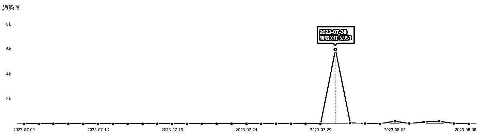

# 视频号图文流量大，百万阅读量给公众号涨粉 6 千多

> 原文：[`www.yuque.com/for_lazy/xkrm14/ywxaf1vxg25fadl2`](https://www.yuque.com/for_lazy/xkrm14/ywxaf1vxg25fadl2)

<ne-p id="u06077ef8" data-lake-id="u06077ef8"><ne-text id="ud82db274">作者： 默默</ne-text></ne-p> <ne-p id="u28143514" data-lake-id="u28143514"><ne-text id="u75646b68">日期：2023-08-09</ne-text></ne-p> <ne-p id="uac7c93bd" data-lake-id="uac7c93bd"><ne-text id="u774a84e8">点赞数：</ne-text><ne-text id="u3a95e5da" ne-bold="true">121</ne-text></ne-p> <ne-hole id="u98ebe7eb" data-lake-id="u98ebe7eb"><ne-card data-card-name="hr" data-card-type="block" id="xW1SG" data-event-boundary="card"><ne-p id="u59e20652" data-lake-id="u59e20652"><ne-text id="u349554d6">正文：</ne-text></ne-p> <ne-p id="ue710a42d" data-lake-id="ue710a42d"><ne-text id="ua873ccc3">视频号给公众号导流涨粉，现在视频号图文流量也很大，我在 7.30 号发的一个书的摘抄语录，百万阅读量，给公众号涨粉 6 千多。之后每天继续发图文，大概一万阅读量能给公众号涨粉 100 多人。</ne-text></ne-p> <ne-p id="ua5bea51d" data-lake-id="ua5bea51d"><ne-card data-card-name="image" data-card-type="inline" id="P0CNX" data-event-boundary="card"></ne-card></ne-p> <ne-hole id="uf0df607d" data-lake-id="uf0df607d"><ne-card data-card-name="hr" data-card-type="block" id="Bb9bN" data-event-boundary="card"><ne-p id="ud24029d4" data-lake-id="ud24029d4"><ne-text id="u48c78867">评论区：</ne-text></ne-p> <ne-p id="u76cd550c" data-lake-id="u76cd550c"><ne-text id="ua871f621">陈陈陈 : 视频号图文怎么做呀</ne-text></ne-p> <ne-p id="ucf69f837" data-lake-id="ucf69f837"><ne-text id="ud8d295f8">青空明月 : 感谢分享[爱心]</ne-text></ne-p> <ne-p id="u715c164f" data-lake-id="u715c164f"><ne-text id="u3bd613f0">亦恕 : 跟抖音一样</ne-text></ne-p> <ne-p id="u22afeacb" data-lake-id="u22afeacb"><ne-text id="u495fc501">背后的落叶 : 如何导流到公众号呢</ne-text></ne-p> <ne-p id="u07be26c0" data-lake-id="u07be26c0"><ne-text id="u9a30fc0b">默默 : 视频号关联公众号就可以</ne-text></ne-p> <ne-p id="u6d50116b" data-lake-id="u6d50116b"><ne-text id="u11b901ce">阳光 : 这个功能已经关闭很久了吧 新号都关联不上了</ne-text></ne-p> <ne-p id="u4781c589" data-lake-id="u4781c589"><ne-text id="ub954ad01">卓鑫然 : 兄弟留个微信</ne-text></ne-p> <ne-hole id="u4af479e0" data-lake-id="u4af479e0"><ne-card data-card-name="hr" data-card-type="block" id="jbbkD" data-event-boundary="card"><ne-p id="ub5a99fb0" data-lake-id="ub5a99fb0"><ne-text id="u28722e9f">公众号懒人找资源，懒人专属群分享</ne-text></ne-p></ne-card></ne-hole></ne-card></ne-hole></ne-card></ne-hole>