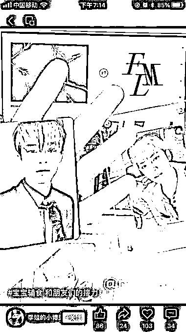
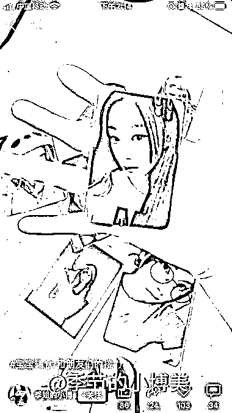
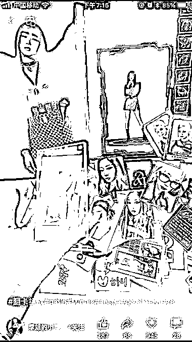
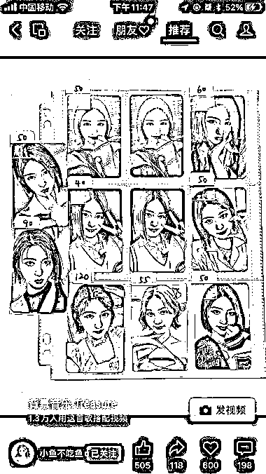

# 视频号追星小卡热卖，年轻人互动热情高

> 原文：[`www.yuque.com/for_lazy/xkrm14/du9v37prfrnuryss`](https://www.yuque.com/for_lazy/xkrm14/du9v37prfrnuryss)

作者： 星辰

日期：2023-08-10

点赞数：77

<ne-hole id="u25bcfd00" data-lake-id="u25bcfd00">

正文：

视频号卖追星小卡，互动非常大。 之前以为视频号基本上都是中老年人，最近发现年轻人越来越多了。 比如这个卡片，最近总刷到，而且点赞评论的人都很多，有的好几万赞。刚开始看不懂到底是啥，评论区也总是一些行话，根本看不懂，什么冬卡，什么 XX 卡之类的。 研究了半天才发现，原来是卖追星小卡的，而且都贼贵。 比如冬卡，其实就是 winter 的卡，而 winter 则是一个韩国组合 aespa 的成员。 如果你不是追星的，压根不知道。 有点类似以前小浣熊干脆面的水浒卡，只是现在都是明星卡。而且这些卖卡的人，在视频号，小红书，转转等各大平台都有分布。还有跑单费 10%-20%

<ne-hole id="u0034fe1b" data-lake-id="u0034fe1b">

评论区：

晓光 : 有侵权风险不？

星辰 : 他们这些卖的都是二手卡，没侵权风险。我猜测可能是他们大量的倒手买卖，或者是自己买盲盒抽出来的。当然，好像市面上有一些卡是假的卡，这种就不知道了，也许有风险

鞭炮 : b 站也有一些 up 主，每天接收粉丝寄过来的卡，她们叫“开丑卡”，粉丝把自己不要的丑卡给 up 主做点评展示，这种模式也很多人爱看。

<ne-hole id="u8923c723" data-lake-id="u8923c723">

公众号懒人找资源，懒人专属群分享

</ne-hole></ne-hole></ne-hole>