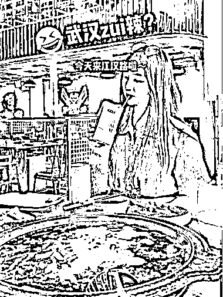
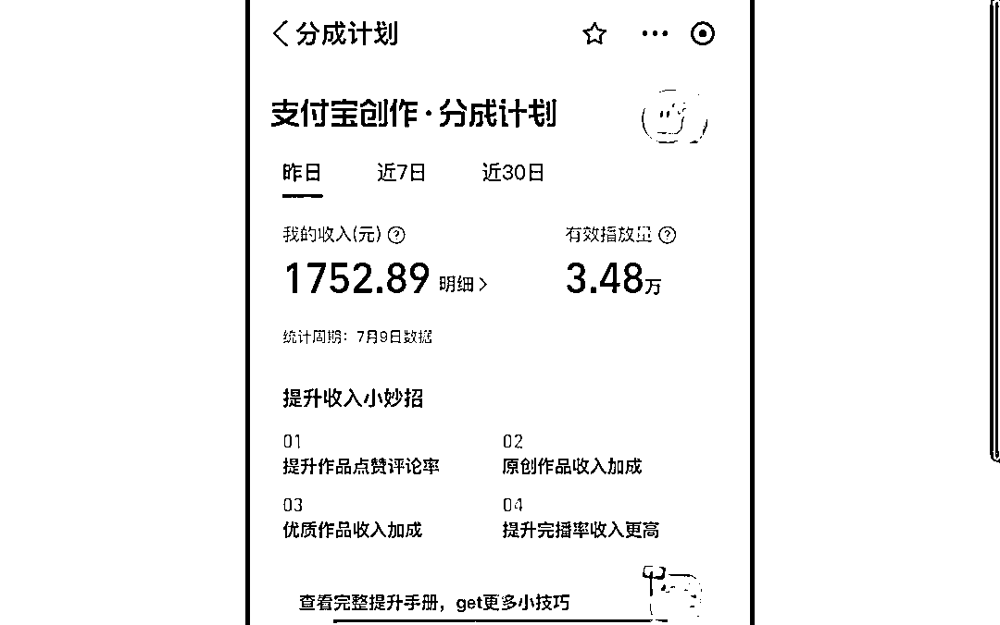
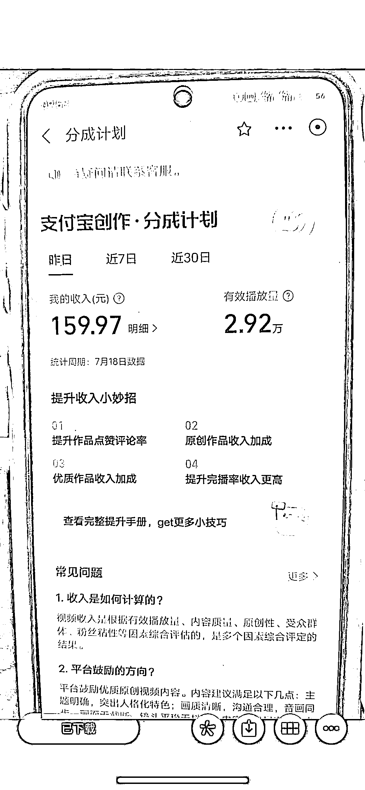

# 支付宝分成玩法总结

> 原文：[`www.yuque.com/for_lazy/xkrm14/wbuy4gt16s47hc0n`](https://www.yuque.com/for_lazy/xkrm14/wbuy4gt16s47hc0n)

<ne-text id="udee6b9a7">作者： 子白</ne-text>

<ne-text id="u6e466a57">日期：2023-08-11</ne-text>

<ne-text id="u9a846e74">点赞数：</ne-text><ne-text id="uab11ec57" ne-bold="true">146</ne-text>

<ne-hole id="uba801877" data-lake-id="uba801877"><ne-card data-card-name="hr" data-card-type="block" id="wJjwS" data-event-boundary="card">

<ne-text id="ubcc393be">正文：</ne-text>

<ne-text id="ucae0442d">支付宝分成玩法总结： 感谢白丁老师的倾情分享</ne-text> <ne-text id="u3579db63">先做内容，把画风过了，最后解决 100 活跃粉丝的事，当你的画风过了其实 100 活跃粉丝也够了，不要互刷，都是无效粉丝，别听抖音营销号瞎扯，他们都是没有做出结果的，就蹭个热点。</ne-text> <ne-text id="uc3454c27">我们倾向于做二创或者原创，好处是可以拿到高单价和持续做，符合平台要求，做搬运迟早会被嘎掉。</ne-text> <ne-text id="ua7c66bfb">封面不要有黑边、模糊，内容方面就按中视频的要求，加配音解说，视频画面与文案相关即可，分辨率 720P 以上。</ne-text> <ne-text id="uce2683f3">财经和探店是重点扶持领域，已经在做财经和探店的博主一定要入驻。 对于做内容的，我们推荐做探店、美食、好物推荐、手工制作 、萌宠、科普、家居生活</ne-text> <ne-text id="u105180a6">、三农、数码科技、育儿、旅行、汽车，这些领域都是符合支付宝生活号的内容调性。</ne-text> <ne-text id="u7f0b56c8">必须注重封面，发布内容记得用电脑发布，可自定义封面（s.alipay.com）。画质 720P 以上，模糊的视频会被判非优质内容，取消分成计划。</ne-text> <ne-text id="ued466d7f">通过分成计划后也不要批量搬运或制作垃圾视频，平台会巡检，内容低质就会降单价甚至取消分成。</ne-text> <ne-text id="u9316b83a">最后建议大家平常心，支付宝生活号用户现在不多，发出去的视频两位数播放已经算多了，心态要佛系，万一爆一个的收入很可观，近期明显感觉到出爆文比以前多了，视频的播放量也在上升，所以稳住持续干，现在是跑马圈地，占个坑等待爆发。</ne-text>

<ne-card data-card-name="image" data-card-type="inline" id="Kw3XL" data-event-boundary="card"></ne-card>

<ne-card data-card-name="image" data-card-type="inline" id="qPUAm" data-event-boundary="card"></ne-card>

<ne-card data-card-name="image" data-card-type="inline" id="UT5bU" data-event-boundary="card"></ne-card>

<ne-card data-card-name="image" data-card-type="inline" id="M4TN6" data-event-boundary="card"></ne-card>

<ne-card data-card-name="image" data-card-type="inline" id="x3MWt" data-event-boundary="card"></ne-card>

<ne-card data-card-name="image" data-card-type="inline" id="QIBM5" data-event-boundary="card"></ne-card>

<ne-card data-card-name="image" data-card-type="inline" id="dVDj3" data-event-boundary="card"></ne-card>

<ne-card data-card-name="image" data-card-type="inline" id="MdhDo" data-event-boundary="card"></ne-card>

<ne-hole id="u035ebcd4" data-lake-id="u035ebcd4"><ne-card data-card-name="hr" data-card-type="block" id="nJ7xj" data-event-boundary="card">

<ne-text id="u9c1e39b0">评论区：</ne-text>

<ne-text id="u6db6a522">毛豆 : 6 万播放量，收益 3700？这单价放眼全球，即便不是最高，也接近最高了吧</ne-text>

<ne-text id="u13e2844d">子白 : 收益奇高，播放奇低</ne-text>

<ne-text id="uba069a79">娜娜 : 支付宝目前估计玩的人少，适合小白入局吗</ne-text>

<ne-text id="u0ae01d0e">子白 : 可以入局占坑</ne-text>

<ne-text id="uca7cb2cd">沙滩螃蟹 : 好像是需要个体工商资质</ne-text>

<ne-text id="u11aeb1ee">希平 : 个体户 9.9 元搞一个</ne-text>

<ne-hole id="ua46ef5af" data-lake-id="ua46ef5af"><ne-card data-card-name="hr" data-card-type="block" id="vAKLl" data-event-boundary="card">

<ne-text id="u2c52145a">公众号懒人找资源，懒人专属群分享</ne-text>

</ne-card></ne-hole></ne-card></ne-hole></ne-card></ne-hole>