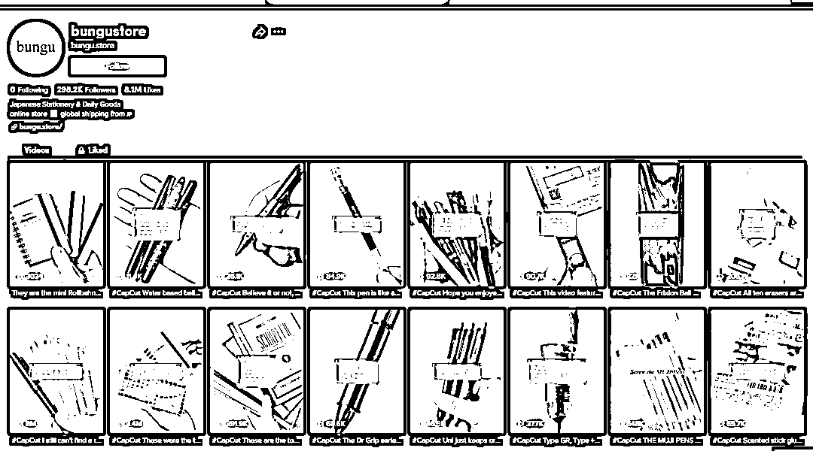
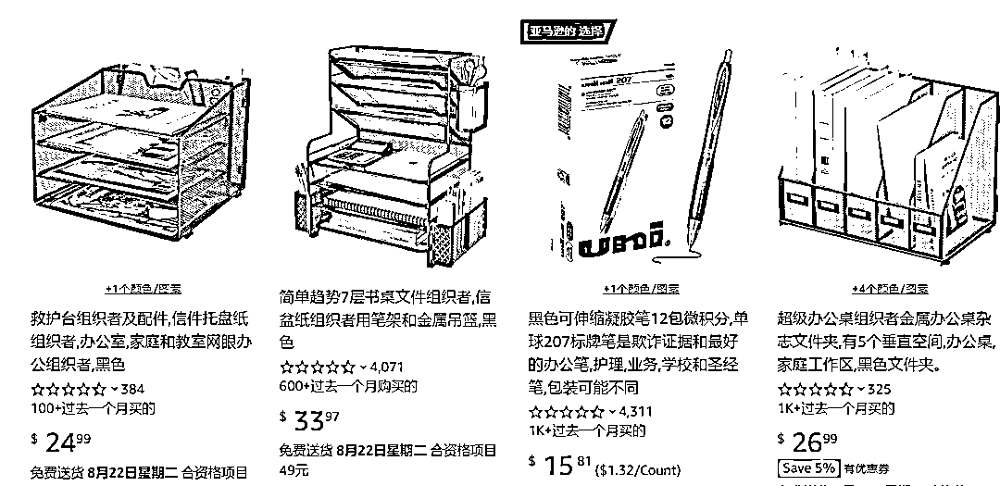

# 返校季，创意文具走红

> 原文：[`www.yuque.com/for_lazy/xkrm14/kmrpowadw6qh8fdw`](https://www.yuque.com/for_lazy/xkrm14/kmrpowadw6qh8fdw)

<ne-text id="u3d1e20ff">作者： 月亮代表我的心</ne-text>

<ne-text id="u0d80a594">日期：2023-08-11</ne-text>

<ne-text id="u934593a8">点赞数：</ne-text><ne-text id="u2b042697" ne-bold="true">124</ne-text>

<ne-hole id="uae69d7f4" data-lake-id="uae69d7f4"><ne-card data-card-name="hr" data-card-type="block" id="CD6Xv" data-event-boundary="card">

<ne-text id="ub0ec04b1">正文：</ne-text>

<ne-text id="u00b16fb3">返校季，创意文具走红</ne-text> <ne-text id="u19451aa0">在 Instagram 上，漂亮的“Instagrammable”文具产品销量激增，特别是一些创意笔记本和日记本成为受追捧的主流产品，#planneraddict 标签也被提及了近 450 万次，搜索引擎上，最具竞争力的术语“铅笔盒”每月的搜索量超过 60K。</ne-text> <ne-text id="u021cffd5">TikTok 上，一位名为@bungustore 的文具用品店账号更是十分火爆。这个账号日常主要发布一些钢笔、自动铅笔及多功能笔的产品视频，在最近，视频曝光数据非常不错，接连出现了几条近千万浏览量的爆款视频。</ne-text> <ne-text id="u866a0ccf">一条展示“多功能荧光笔和自动铅笔”的视频，其浏览量高达 800 万次，并同时收获了 110 万个用户点赞数，前一天还有条“铅笔盒”的视频也获得了 340 万的浏览量。一条展示集圆珠笔、橡皮擦、自动铅笔于一体的“多功能记号笔”视频也意外大爆，获得了 770 万次浏览量和 94.7 万的点赞，并得到评论区众多粉丝用户的追捧。一条“创意自动铅笔”视频获得千万浏览量。根据后台数据显示，这条视频发布后，短短几天内浏览量就飙升至 1000 万次，并获得 130 万个点赞数。</ne-text> <ne-text id="u5b5bca0d">正值返校季，海外消费者对文具产品萌发了更强烈的兴趣。亚马逊平台上，不少文具用品的链接都在过去一个月迎来了不少的出单量。</ne-text>

<ne-card data-card-name="image" data-card-type="inline" id="lfnkw" data-event-boundary="card"></ne-card>

<ne-card data-card-name="image" data-card-type="inline" id="lbSO4" data-event-boundary="card"></ne-card>

<ne-hole id="u8caf096f" data-lake-id="u8caf096f"><ne-card data-card-name="hr" data-card-type="block" id="LQJ44" data-event-boundary="card">

<ne-text id="uf3df7efd">评论区：</ne-text>

<ne-text id="u858532d5">半扇咸鱼 : 那国内各平台也是热门</ne-text>

<ne-hole id="u99ca504a" data-lake-id="u99ca504a"><ne-card data-card-name="hr" data-card-type="block" id="gSTDR" data-event-boundary="card">

<ne-text id="ud6848d87">公众号懒人找资源，懒人专属群分享</ne-text>

</ne-card></ne-hole></ne-card></ne-hole></ne-card></ne-hole>