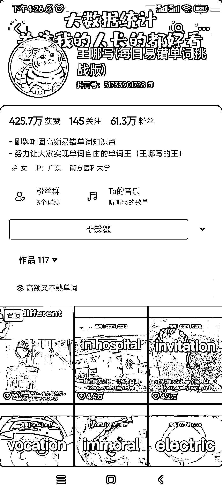

# 每日易错单词挑战，互动选项引爆评论数

> 原文：[`www.yuque.com/for_lazy/xkrm14/zmgwolmqnpmzrugm`](https://www.yuque.com/for_lazy/xkrm14/zmgwolmqnpmzrugm)

作者： 转下脖子

日期：2023-08-09

点赞数：109

<ne-hole id="u68205121" data-lake-id="u68205121"><ne-card data-card-name="hr" data-card-type="block" id="zEipw" data-event-boundary="card">

正文：

博主：王哪写(每日易错单词挑战版) 粉丝：61.2w 笔记数：117 视频内容就是简单的每天分享一个单词，唯一不同的是他视频中的互动选项，直接给用户做选择题，评论数异常高，每条视频的数据也非常好。 互动选项的用法把用户带入做题中，这种玩法可以用在很多其他学科领域中，也可以用在知识科普那一块，互动做的好，流量也来得快。

<ne-card data-card-name="image" data-card-type="inline" id="W5hzr" data-event-boundary="card"></ne-card>

<ne-card data-card-name="image" data-card-type="inline" id="srp0j" data-event-boundary="card"></ne-card>

<ne-hole id="ua2f1104f" data-lake-id="ua2f1104f"><ne-card data-card-name="hr" data-card-type="block" id="MYDLZ" data-event-boundary="card">

评论区：

王左右 : 这是怎么做到，点击视频屏幕，可以选择选项？

Mark-小马哥 : 是呀，求解！这是怎么做到点击视频屏幕，可以选择选项？

强哥手记 : 是呀，求解！这是怎么做到点击视频屏幕，可以选择选项？

南国之北 : 大哥求教

空白 : 应该是设置了投票吧

王嘟嘟 : 好思路

<ne-hole id="ue5ee48c7" data-lake-id="ue5ee48c7"><ne-card data-card-name="hr" data-card-type="block" id="pghtU" data-event-boundary="card">

公众号懒人找资源，懒人专属群分享

</ne-card></ne-hole></ne-card></ne-hole></ne-card></ne-hole>