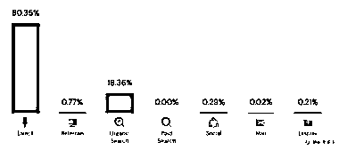
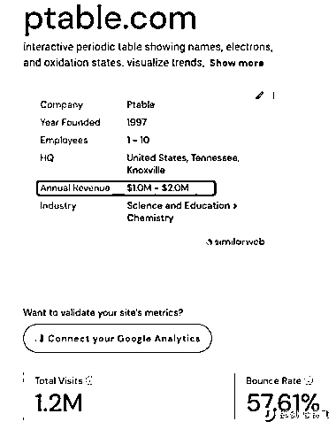
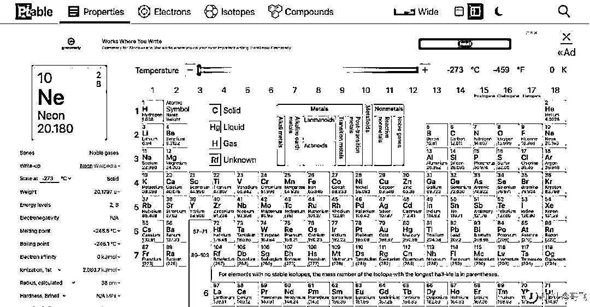

# 海外小而美工具类网站，通过在线可视化元素周期表实现百万美元收入

> 原文：[`www.yuque.com/for_lazy/xkrm14/vb9d3mbxenevwpit`](https://www.yuque.com/for_lazy/xkrm14/vb9d3mbxenevwpit)

<ne-p id="uacb27491" data-lake-id="uacb27491"><ne-text id="u114ac738">作者： 王小竹</ne-text></ne-p> <ne-p id="u805d70f0" data-lake-id="u805d70f0"><ne-text id="u0e2cb9bb">日期：2023-08-09</ne-text></ne-p> <ne-p id="u3fce330d" data-lake-id="u3fce330d"><ne-text id="ue8cd4343">点赞数：</ne-text><ne-text id="uddc07c87" ne-bold="true">96</ne-text></ne-p> <ne-hole id="udc28d338" data-lake-id="udc28d338"><ne-card data-card-name="hr" data-card-type="block" id="dTmcz" data-event-boundary="card"><ne-p id="ua5e4995a" data-lake-id="ua5e4995a"><ne-text id="u2f48b94b">正文：</ne-text></ne-p> <ne-p id="u243db763" data-lake-id="u243db763"><ne-text id="u70694e0c">海外小而美工具类网站，在线可视化元素周期表。 收入方式：谷歌广告 每月访问量在 120 万，收入每年预估超过百万美元。</ne-text></ne-p> <ne-p id="u26746acf" data-lake-id="u26746acf"><ne-card data-card-name="image" data-card-type="inline" id="kY6C8" data-event-boundary="card"></ne-card></ne-p> <ne-p id="u2821415f" data-lake-id="u2821415f"><ne-card data-card-name="image" data-card-type="inline" id="ANhVa" data-event-boundary="card"></ne-card></ne-p> <ne-p id="u909a7f44" data-lake-id="u909a7f44"><ne-card data-card-name="image" data-card-type="inline" id="NITsB" data-event-boundary="card">  <ne-p id="u22f835f1" data-lake-id="u22f835f1"><ne-card data-card-name="image" data-card-type="inline" id="tGIux" data-event-boundary="card"></ne-card></ne-p> <ne-p id="uc682c9dc" data-lake-id="uc682c9dc"><ne-card data-card-name="image" data-card-type="inline" id="mTl3X" data-event-boundary="card"></ne-card></ne-p> <ne-hole id="u830eeffe" data-lake-id="u830eeffe"><ne-card data-card-name="hr" data-card-type="block" id="VLxEt" data-event-boundary="card"><ne-p id="u2ac04a62" data-lake-id="u2ac04a62"><ne-text id="ud55dc2f4">评论区：</ne-text></ne-p> <ne-p id="ub19fdb7c" data-lake-id="ub19fdb7c"><ne-text id="u973561ee">胖大魔 : 哟[奸笑]</ne-text></ne-p> <ne-p id="uadbddd87" data-lake-id="uadbddd87"><ne-text id="u1dd87183">王小竹 : 嘿嘿</ne-text></ne-p> <ne-p id="u23e56cd1" data-lake-id="u23e56cd1"><ne-text id="uc47490dd">三林 : 年，不是月，也只是预估。</ne-text></ne-p> <ne-p id="uad8b0a9b" data-lake-id="uad8b0a9b"><ne-text id="u850a6959">王小竹 : 感谢纠正，打错了</ne-text></ne-p> <ne-p id="uea6f2fd7" data-lake-id="uea6f2fd7"><ne-text id="udb1baae3">九歌 : 很不错的方向</ne-text></ne-p> <ne-p id="ucdff78c3" data-lake-id="ucdff78c3"><ne-text id="udf121b7d">晴天哥哥 : 都是哥飞的粉丝呀</ne-text></ne-p> <ne-hole id="u83b3d118" data-lake-id="u83b3d118"><ne-card data-card-name="hr" data-card-type="block" id="YVXoe" data-event-boundary="card"><ne-p id="u5a355996" data-lake-id="u5a355996"><ne-text id="uf7d83347">公众号懒人找资源，懒人专属群分享</ne-text></ne-p></ne-card></ne-hole></ne-card></ne-hole></ne-card></ne-p></ne-card></ne-hole>