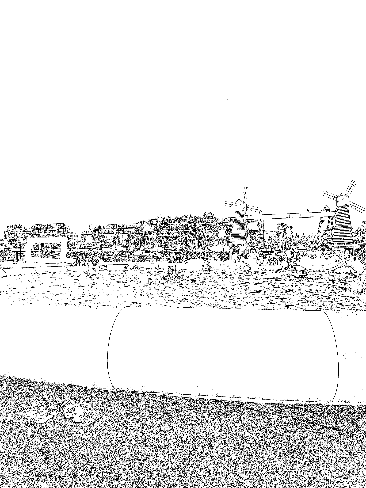
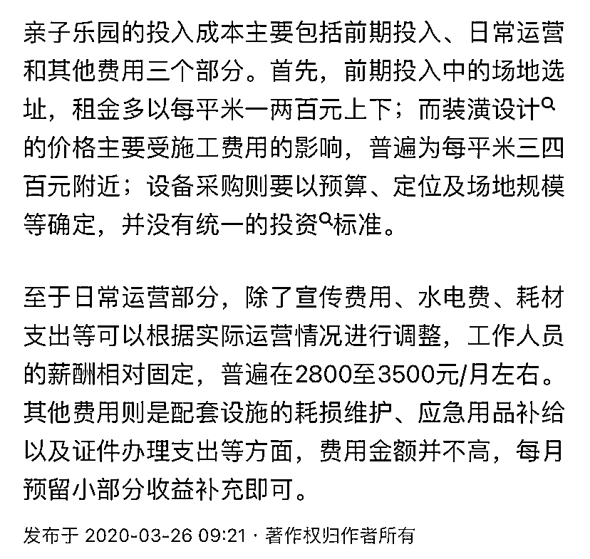

# 高回报的市区外亲子乐园，每月营收超过 20 万元

> 原文：[`www.yuque.com/for_lazy/xkrm14/pdtscc2q8f77qa6p`](https://www.yuque.com/for_lazy/xkrm14/pdtscc2q8f77qa6p)

作者： Yao

日期：2023-08-10

点赞数：83

<ne-hole id="u07594253" data-lake-id="u07594253">

正文：

线下 实体项目 户外亲子乐园 地理位置在市区外（场地成本会降下来），绝大多数项目无动力，电的费用也会降下来 票价人均 20 元，营业到晚上 11 点，趁暑期，哪怕会热一些，但营业时间可以覆盖到不少孩子。 16-18 点，两个小时的时间基本已经有 200 人以上了，暑期一个月的营收可能不下 20W

<ne-hole id="u3e65448a" data-lake-id="u3e65448a">

评论区：

Yao : 宣传途径之一：跟幼儿园合作，发送免费券，但是只免小孩，大人依旧要收费 因为一般都是开车带着孩子去的，现场被告知大人还要收费，出于照看孩子的需求，是会付费的，来都来了（别问，问就是亲身经历，哈哈哈

刘继春 : 这个是真的，我家孩子在老家天天晚上去乐园玩，那里的人真的超级多

Alex : 🎉🎉🎉

云鹏 : 夏天玩水，冬天玩雪

<ne-hole id="u01424b5b" data-lake-id="u01424b5b">

公众号懒人找资源，懒人专属群分享

</ne-hole></ne-hole></ne-hole>