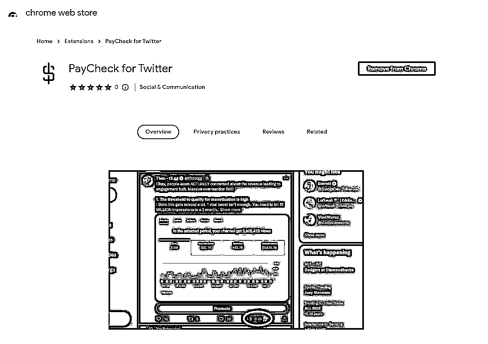

# 查看推文估计价值的方法

> 原文：[`www.yuque.com/for_lazy/xkrm14/mi1qg0paz7u085qg`](https://www.yuque.com/for_lazy/xkrm14/mi1qg0paz7u085qg)

<ne-p id="u9b944c22" data-lake-id="u9b944c22"><ne-text id="u7a8fc435">作者： 元峰</ne-text></ne-p> <ne-p id="u1aec8629" data-lake-id="u1aec8629"><ne-text id="u2abc421b">日期：2023-08-11</ne-text></ne-p> <ne-p id="u8108ec4f" data-lake-id="u8108ec4f"><ne-text id="u0fc65cfb">点赞数：</ne-text><ne-text id="uc630c1e6" ne-bold="true">68</ne-text></ne-p> <ne-hole id="u84bb303d" data-lake-id="u84bb303d"><ne-card data-card-name="hr" data-card-type="block" id="VgG1j" data-event-boundary="card"><ne-p id="u9c18e0ee" data-lake-id="u9c18e0ee"><ne-text id="u426022c2">正文：</ne-text></ne-p> <ne-p id="u55a673ba" data-lake-id="u55a673ba"><ne-text id="u7598ba18">X 最近发送了数百万美元的创作者支出。 但是，想知道你的推文的价值吗？ 以下是查看推文估计价值的方法： 使用 PayCheck for Twitter</ne-text> <ne-text id="ub506e8dc">的 Chrome 扩展程序，用于估算每个帖子的广告收入。</ne-text> <ne-text id="ube5c3019">[</ne-text>[<ne-text id="uc70083b0">https://chrome.google.com/webstore/detail/paycheck</ne-text>](https://chrome.google.com/webstore/detail/paycheck)<ne-text id="ud0ab19ac">...</ne-text> <ne-text id="u21fae0c8">](</ne-text>[<ne-text id="ud2b09c7d">https://chrome.google.com/webstore/detail/paycheck-for-</ne-text>](https://chrome.google.com/webstore/detail/paycheck-for-)<ne-text id="uf369d0b5">twitter/ldgffedhocinnolmaaecnppdfmmofilp)</ne-text></ne-p> <ne-p id="u239f4bed" data-lake-id="u239f4bed"><ne-card data-card-name="image" data-card-type="inline" id="XPBRe" data-event-boundary="card">  <ne-p id="u8ae21984" data-lake-id="u8ae21984"><ne-card data-card-name="image" data-card-type="inline" id="kTbd1" data-event-boundary="card">  <ne-hole id="u0a531388" data-lake-id="u0a531388"><ne-card data-card-name="hr" data-card-type="block" id="kxx3Z" data-event-boundary="card"><ne-p id="uf27b472e" data-lake-id="uf27b472e"><ne-text id="u82717c80">评论区：</ne-text></ne-p> <ne-hole id="ued253367" data-lake-id="ued253367"><ne-card data-card-name="hr" data-card-type="block" id="d7jlL" data-event-boundary="card"><ne-p id="u58326bc4" data-lake-id="u58326bc4"><ne-text id="u51b9be1f">公众号懒人找资源，懒人专属群分享</ne-text></ne-p></ne-card></ne-hole></ne-card></ne-hole></ne-card></ne-p></ne-card></ne-p></ne-card></ne-hole>