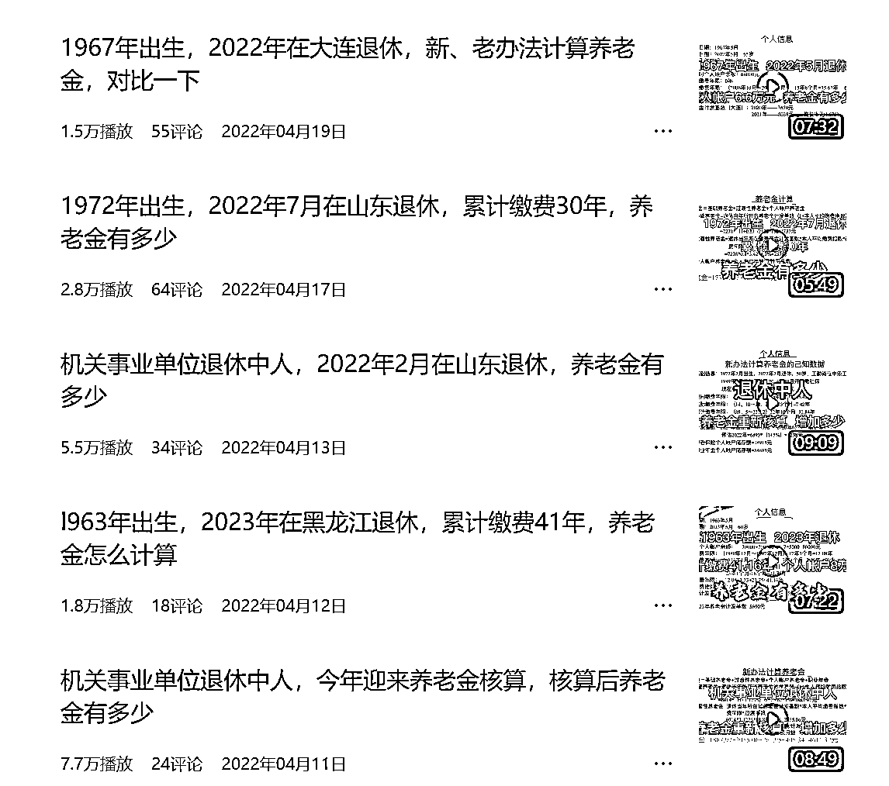
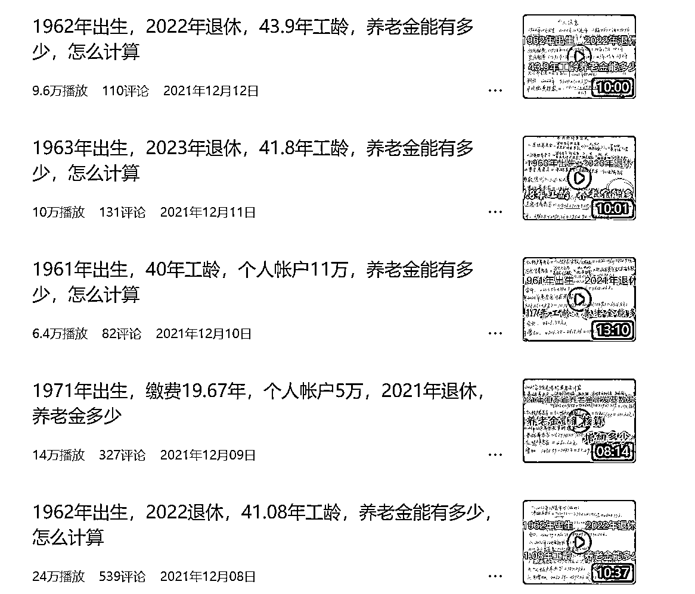

# 退休老太太的账号，计算养老金，阅读量不低

> 原文：[`www.yuque.com/for_lazy/xkrm14/mnp8at74tzwmv4q7`](https://www.yuque.com/for_lazy/xkrm14/mnp8at74tzwmv4q7)

<ne-text id="uffa3b807">作者： 元宝</ne-text>

<ne-text id="u75c67909">日期：2023-08-07</ne-text>

<ne-text id="u129972ab">点赞数：</ne-text><ne-text id="u099ec993" ne-bold="true">61</ne-text>

<ne-hole id="u828b68ab" data-lake-id="u828b68ab"><ne-card data-card-name="hr" data-card-type="block" id="Jamor" data-event-boundary="card">

<ne-text id="u31c662b0">正文：</ne-text>

<ne-text id="u85685be0">这是个退休老太太的账号，还挺有趣的，专门计算养老金，很符合她的人设。有点像做星座账号的，12 个星座轮流说事。这个账号可以各大省来回说，而且阅读量还不低，预估一个月收入 W+有的。她发个人生活阅读量就不高。然后查了下公众号里面也有说这个的，但阅读量不高，是公号不喜欢这类吧。</ne-text>

<ne-card data-card-name="image" data-card-type="inline" id="dvLQK" data-event-boundary="card">  <ne-p id="u46a92f4d" data-lake-id="u46a92f4d"><ne-card data-card-name="image" data-card-type="inline" id="PnzKi" data-event-boundary="card">  <ne-p id="u7981caf2" data-lake-id="u7981caf2"><ne-card data-card-name="image" data-card-type="inline" id="liuFT" data-event-boundary="card">  <ne-p id="u5a79bcb8" data-lake-id="u5a79bcb8"><ne-card data-card-name="image" data-card-type="inline" id="mPns7" data-event-boundary="card">  <ne-hole id="uf26abbdd" data-lake-id="uf26abbdd"><ne-card data-card-name="hr" data-card-type="block" id="YIb3P" data-event-boundary="card"><ne-p id="u5d45ba6b" data-lake-id="u5d45ba6b"><ne-text id="u605d263f">评论区：</ne-text>

<ne-hole id="u11931334" data-lake-id="u11931334"><ne-card data-card-name="hr" data-card-type="block" id="oqB0f" data-event-boundary="card">

<ne-text id="uda31e136">公众号懒人找资源，懒人专属群分享</ne-text>

</ne-card></ne-hole></ne-card></ne-hole></ne-card></ne-p></ne-card></ne-p></ne-card></ne-p></ne-card></ne-p></ne-card></ne-hole>