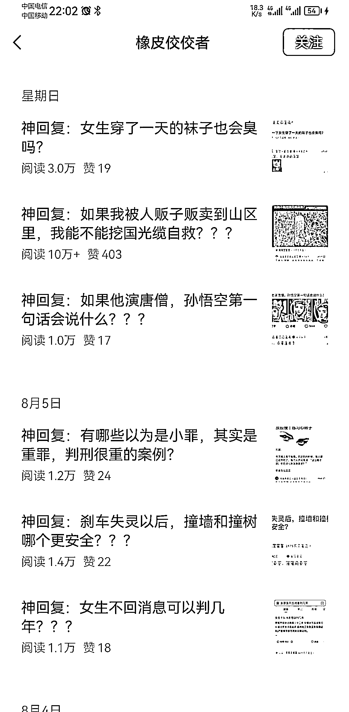
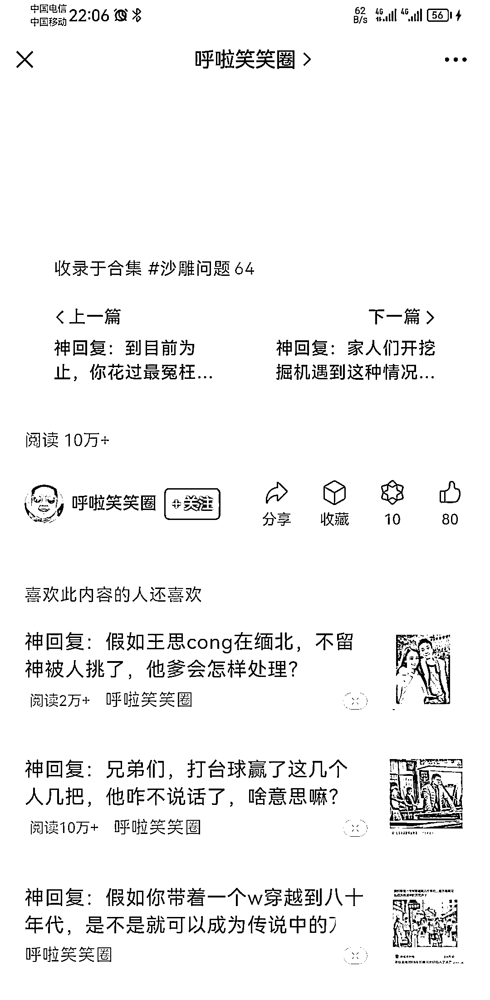

# 皮皮虾神评+笑话，公众号流量不错

> 原文：[`www.yuque.com/for_lazy/xkrm14/qn1nao7ydyu4b1o3`](https://www.yuque.com/for_lazy/xkrm14/qn1nao7ydyu4b1o3)

<ne-text id="u89f86516">作者： 默言</ne-text>

<ne-text id="u7e21f82e">日期：2023-08-14</ne-text>

<ne-text id="uc336ab94">点赞数：</ne-text><ne-text id="u4b37f765" ne-bold="true">83</ne-text>

<ne-hole id="ue8af1c2e" data-lake-id="ue8af1c2e"><ne-card data-card-name="hr" data-card-type="block" id="hl7dH" data-event-boundary="card">

<ne-text id="u1642f329">正文：</ne-text>

<ne-text id="ue6890e34">从皮皮虾搬运神评加上些笑话发公众号流量也不错</ne-text>

<ne-card data-card-name="image" data-card-type="inline" id="z0ztn" data-event-boundary="card"></ne-card>

<ne-card data-card-name="image" data-card-type="inline" id="OGdjO" data-event-boundary="card"></ne-card>

<ne-card data-card-name="image" data-card-type="inline" id="IQ3H3" data-event-boundary="card"></ne-card>

<ne-card data-card-name="image" data-card-type="inline" id="lhjyN" data-event-boundary="card"></ne-card>

<ne-hole id="ub4ad8147" data-lake-id="ub4ad8147"><ne-card data-card-name="hr" data-card-type="block" id="NaOAO" data-event-boundary="card">

<ne-text id="u763dd978">评论区：</ne-text>

<ne-text id="u8cdeed9e">西门广坤 : 请问两个问题 发的原创么？ 公众号有基础粉丝多少？</ne-text>

<ne-text id="ufe9d7bd2">默言 : 是原创，我也是刷到的</ne-text>

<ne-text id="u125cb710">鸡蛋面 : 请问皮皮虾是啥？</ne-text>

<ne-text id="u4c2f5ecb">默言 : 一个短视频 APP</ne-text>

<ne-text id="u82ce1e6c">老彭 : 搞笑 APP，每天必看哈哈哈</ne-text>

<ne-hole id="u01446b14" data-lake-id="u01446b14"><ne-card data-card-name="hr" data-card-type="block" id="u0oUP" data-event-boundary="card">

<ne-text id="u604c4d33">公众号懒人找资源，懒人专属群分享</ne-text>

</ne-card></ne-hole></ne-card></ne-hole></ne-card></ne-hole>