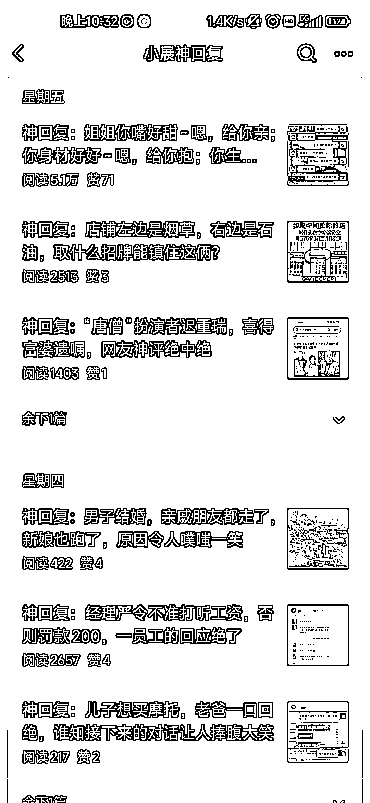

# 公众号神回复系列：爆款文章分享

> 原文：[`www.yuque.com/for_lazy/xkrm14/fxtlgmdbhk83wkbw`](https://www.yuque.com/for_lazy/xkrm14/fxtlgmdbhk83wkbw)

<ne-p id="u8baadec0" data-lake-id="u8baadec0"><ne-text id="u142721d5">作者： 泛音</ne-text></ne-p> <ne-p id="u53638e4d" data-lake-id="u53638e4d"><ne-text id="ue6c8773e">日期：2023-08-14</ne-text></ne-p> <ne-p id="u327958e4" data-lake-id="u327958e4"><ne-text id="uf396c0e9">点赞数：</ne-text><ne-text id="u14e8be14" ne-bold="true">74</ne-text></ne-p> <ne-hole id="u00277b02" data-lake-id="u00277b02"><ne-card data-card-name="hr" data-card-type="block" id="SA7lU" data-event-boundary="card"><ne-p id="ua017409e" data-lake-id="ua017409e"><ne-text id="u13547265">正文：</ne-text></ne-p> <ne-p id="uf1268262" data-lake-id="uf1268262"><ne-text id="u46013258">公众号神回复系列比较容易出爆款，基本上采用的是微信对话截图和搞笑内容截屏相结合的形式。</ne-text> <ne-text id="u10723eb3">本账号一共 45 篇原创文，7 月 23 号起号，6 篇 1w+，其中一篇 10w+，5 篇 5w+，想做或者可以做该系列的朋友可以试试看了</ne-text></ne-p> <ne-p id="u397339ea" data-lake-id="u397339ea"><ne-card data-card-name="image" data-card-type="inline" id="fZTKE" data-event-boundary="card"></ne-card></ne-p> <ne-hole id="u6212b5b9" data-lake-id="u6212b5b9"><ne-card data-card-name="hr" data-card-type="block" id="qsUPQ" data-event-boundary="card"><ne-p id="u63e45181" data-lake-id="u63e45181"><ne-text id="u3ca412bb">评论区：</ne-text></ne-p> <ne-p id="u33854e09" data-lake-id="u33854e09"><ne-text id="u84943f92">Mr.Mcphist : 不错 但这几天流量下来了</ne-text></ne-p> <ne-p id="u3bcfa19c" data-lake-id="u3bcfa19c"><ne-text id="u71afb786">泛音 : 还好，也许选题没切中读者胃口，但一直在流量池</ne-text></ne-p> <ne-p id="ue2e07dd7" data-lake-id="ue2e07dd7"><ne-text id="u17b59531">泛音 : 谢谢老大，第一次中标</ne-text></ne-p> <ne-hole id="uc98cb945" data-lake-id="uc98cb945"><ne-card data-card-name="hr" data-card-type="block" id="NxgqR" data-event-boundary="card"><ne-p id="u13f9e7e3" data-lake-id="u13f9e7e3"><ne-text id="u3064d5d3">公众号懒人找资源，懒人专属群分享</ne-text></ne-p></ne-card></ne-hole></ne-card></ne-hole></ne-card></ne-hole>