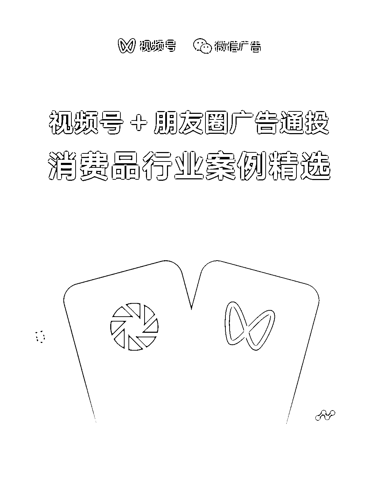
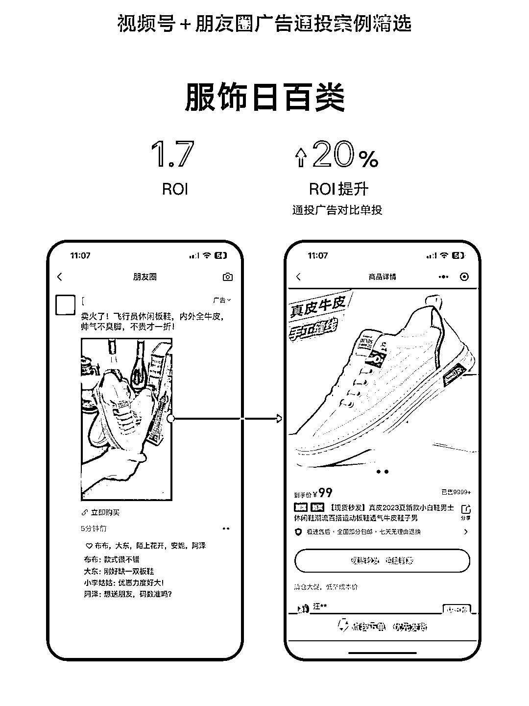
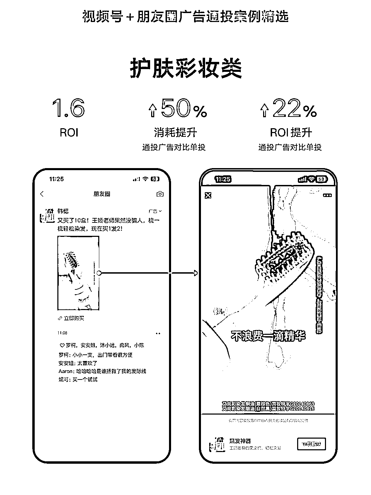
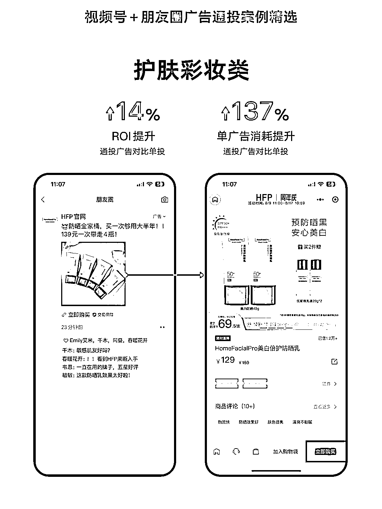
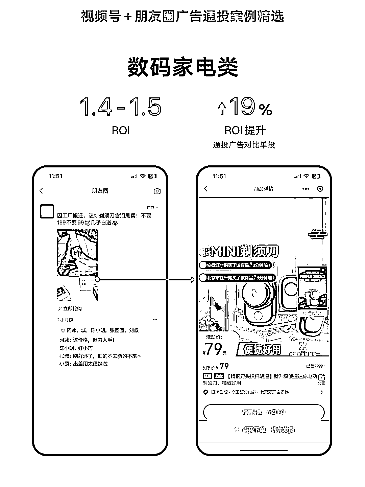
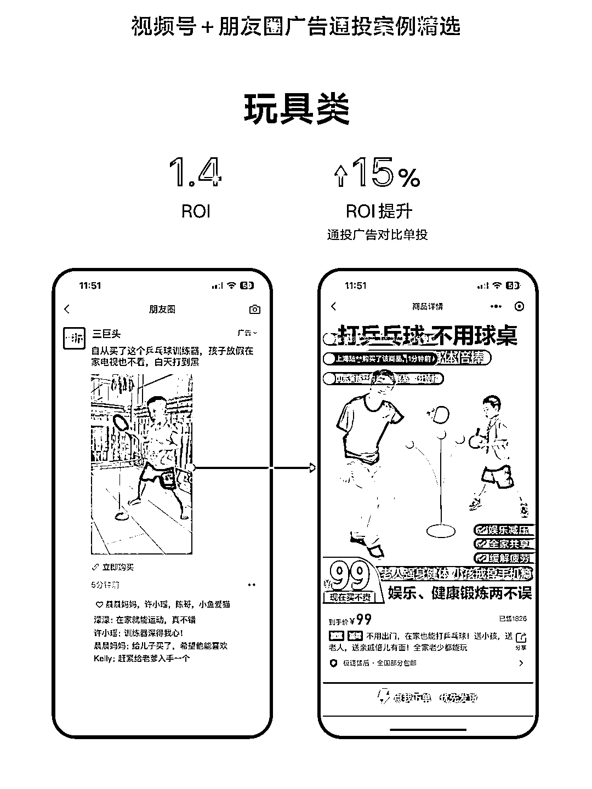

# 微信付费投流，视频号+朋友圈广告通投，消费品行业案例精选

> 原文：[`www.yuque.com/for_lazy/xkrm14/cume272igpqi0ep9`](https://www.yuque.com/for_lazy/xkrm14/cume272igpqi0ep9)

<ne-p id="u5a2dbdab" data-lake-id="u5a2dbdab"><ne-text id="u4beb1891">作者： 不期而遇</ne-text></ne-p> <ne-p id="udcc3b611" data-lake-id="udcc3b611"><ne-text id="ucdce5828">日期：2023-08-16</ne-text></ne-p> <ne-p id="ubc7ab11d" data-lake-id="ubc7ab11d"><ne-text id="u90b14607">点赞数：</ne-text><ne-text id="uacd1e19b" ne-bold="true">65</ne-text></ne-p> <ne-hole id="u7231558c" data-lake-id="u7231558c"><ne-card data-card-name="hr" data-card-type="block" id="rnntB" data-event-boundary="card"><ne-p id="ud8f79d05" data-lake-id="ud8f79d05"><ne-text id="ube289011">正文：</ne-text></ne-p> <ne-p id="ub7a0ceeb" data-lake-id="ub7a0ceeb"><ne-text id="ua13dd774">微信付费投流，朋友圈+视频号投放，这个路径开放太牛了！！！ 微信广告助手 视频号 + 朋友圈广告通投消费品行业案例精选 消费品行业广告主通过视频号 +</ne-text> <ne-text id="u3184c4fd">朋友圈广告通投收获更好投放表现： ✨ 起量更快 通投在多流量版位同时积累数据，从而加速广告起量，消费品行业使用视频号 +</ne-text> <ne-text id="u48a9518b">朋友圈通投的新广告起量率对比单投提升 36%。 ✨ 成本达成率更稳定 通过全流量复用通投数据样本，通投广告 oCPX 成本达成更稳定，视频号 +</ne-text> <ne-text id="u6ff5203a">朋友圈广告通投较单投达成率提升 17%。 💡 投放小技巧 • 在投放管理平台的【广告版位】-【按媒体选择】部分，圈选包含“朋友圈 +</ne-text> <ne-text id="ucba0dfb8">微信视频号”在内的多个广告版位，即可开启通投。 • 根据产品特点适当放宽年龄等定向，扩大用户覆盖。 • 使用爆量素材 + 突出卖点文案，提升用户点击意愿。</ne-text> <ne-text id="u692cba2f">• 落地页突出产品卖点和细节高清图，配合优惠信息，促进用户下单。 8</ne-text> <ne-text id="u98f66bcf">月正值暑假档期，用户活跃度高，整体流量库存更加充足，竞争环境相对宽松，建议广告主把握高性价比拿量机会进行增投，最大化投放效果。</ne-text></ne-p> <ne-p id="ud90c2b1e" data-lake-id="ud90c2b1e"><ne-card data-card-name="image" data-card-type="inline" id="v3bZT" data-event-boundary="card"></ne-card></ne-p> <ne-p id="u1b2663bc" data-lake-id="u1b2663bc"><ne-card data-card-name="image" data-card-type="inline" id="elrPg" data-event-boundary="card"></ne-card></ne-p> <ne-p id="u91ab55b3" data-lake-id="u91ab55b3"><ne-card data-card-name="image" data-card-type="inline" id="XXFWI" data-event-boundary="card"></ne-card></ne-p> <ne-p id="u73cae639" data-lake-id="u73cae639"><ne-card data-card-name="image" data-card-type="inline" id="dfxC9" data-event-boundary="card"></ne-card></ne-p> <ne-p id="u8537adb3" data-lake-id="u8537adb3"><ne-card data-card-name="image" data-card-type="inline" id="tuMjC" data-event-boundary="card"></ne-card></ne-p> <ne-p id="u072c570a" data-lake-id="u072c570a"><ne-card data-card-name="image" data-card-type="inline" id="fS2aQ" data-event-boundary="card"></ne-card></ne-p> <ne-p id="u2c21fefc" data-lake-id="u2c21fefc"><ne-card data-card-name="image" data-card-type="inline" id="JLp26" data-event-boundary="card"></ne-card></ne-p> <ne-p id="u88849d73" data-lake-id="u88849d73"><ne-card data-card-name="image" data-card-type="inline" id="S31ir" data-event-boundary="card"></ne-card></ne-p> <ne-hole id="u524fbaee" data-lake-id="u524fbaee"><ne-card data-card-name="hr" data-card-type="block" id="WAnsV" data-event-boundary="card"><ne-p id="u9cf3189c" data-lake-id="u9cf3189c"><ne-text id="u149a4db3">评论区：</ne-text></ne-p> <ne-p id="u7c41f7e8" data-lake-id="u7c41f7e8"><ne-text id="ud679c63f">不期而遇 : 谢谢亦仁</ne-text></ne-p> <ne-p id="ud95f766a" data-lake-id="ud95f766a"><ne-text id="u044a15ea">辉哥 : 系统全部打通确实厉害，很有想象空间，不知道有没有测试的，效果如何？</ne-text></ne-p> <ne-hole id="u8bbaa6d8" data-lake-id="u8bbaa6d8"><ne-card data-card-name="hr" data-card-type="block" id="BBNib" data-event-boundary="card"><ne-p id="u2c3c3e0e" data-lake-id="u2c3c3e0e"><ne-text id="ucd2dfb13">公众号懒人找资源，懒人专属群分享</ne-text></ne-p></ne-card></ne-hole></ne-card></ne-hole></ne-card></ne-hole>