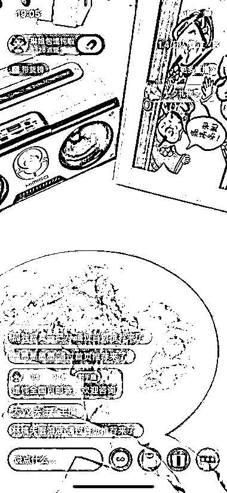
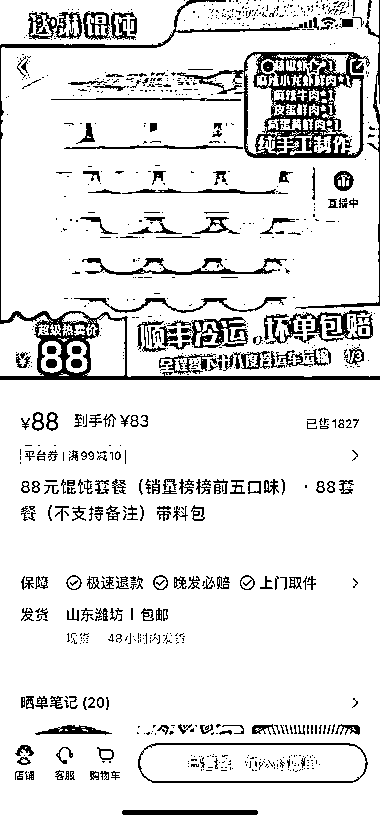

# 小红书直播卖自制混沌，流量销量双丰收

> 原文：[`www.yuque.com/for_lazy/xkrm14/mt2x1lqhggavrr8p`](https://www.yuque.com/for_lazy/xkrm14/mt2x1lqhggavrr8p)

<ne-text id="u19fc8d60">作者： 摇啊摇，摇到</ne-text>

<ne-text id="ua613859e">日期：2023-08-14</ne-text>

<ne-text id="uc606a2e0">点赞数：</ne-text><ne-text id="ud00d250f" ne-bold="true">53</ne-text>

<ne-hole id="u06e7d665" data-lake-id="u06e7d665"><ne-card data-card-name="hr" data-card-type="block" id="sd4jL" data-event-boundary="card">

<ne-text id="u72467b63">正文：</ne-text>

<ne-text id="u7bf4a64d">小红书上直播包混沌，卖自己包的混沌，流量销量都还可以，</ne-text>

<ne-card data-card-name="image" data-card-type="inline" id="KJWXT" data-event-boundary="card"></ne-card>

<ne-card data-card-name="image" data-card-type="inline" id="nlnxS" data-event-boundary="card"></ne-card>

<ne-hole id="u18236f85" data-lake-id="u18236f85"><ne-card data-card-name="hr" data-card-type="block" id="xMzEL" data-event-boundary="card">

<ne-text id="u1b8b9004">评论区：</ne-text>

<ne-text id="uffb18bdb">Lemon : 想知道像这样的，要不要办理相关卫生许可证件，或者存在怎样的风险？</ne-text>

<ne-text id="u3fbde20e">头上两道疤 : 卖吃的肯定要食品证，不要被打假的盯上了，吃不了兜着走</ne-text>

<ne-text id="u2191b10d">朱朱侠 : 馄饨是送的，主要是卖装馄饨的包装盒，至于馄饨怎么处理，是买家的事情，和卖家没有关系[坏笑]</ne-text>

<ne-text id="ubc224889">Alex : 🎉🎉🎉</ne-text>

<ne-hole id="uca79dbe3" data-lake-id="uca79dbe3"><ne-card data-card-name="hr" data-card-type="block" id="KD9tP" data-event-boundary="card">

<ne-text id="u82595737">公众号懒人找资源，懒人专属群分享</ne-text>

</ne-card></ne-hole></ne-card></ne-hole></ne-card></ne-hole>