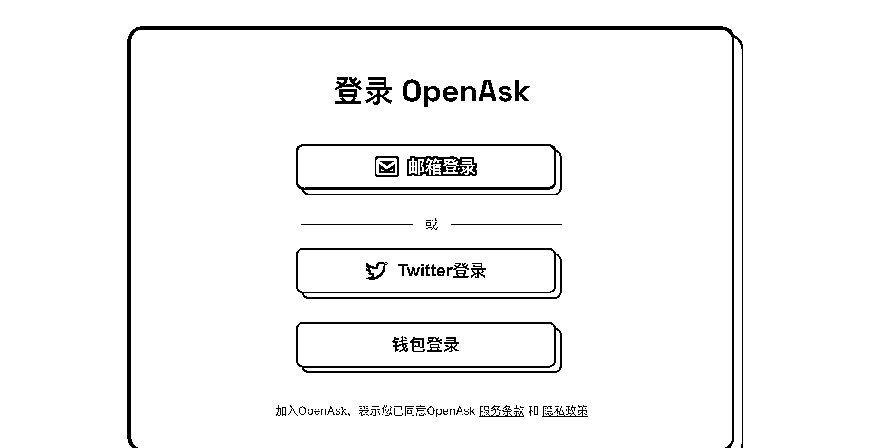
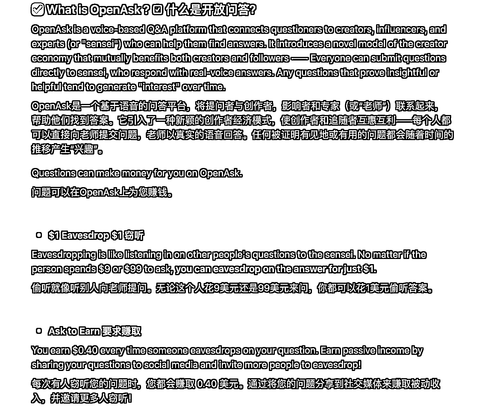

# OpenAsk：回答 10 个问题赚 200 刀，比推特变现能力高

> 原文：[`www.yuque.com/for_lazy/xkrm14/xccntk4ggkwhh5ec`](https://www.yuque.com/for_lazy/xkrm14/xccntk4ggkwhh5ec)

<ne-p id="u44124b7b" data-lake-id="u44124b7b"><ne-text id="u89f35a7b">作者： 苓枫</ne-text></ne-p> <ne-p id="uc9533066" data-lake-id="uc9533066"><ne-text id="u30fee421">日期：2023-08-14</ne-text></ne-p> <ne-p id="u91443499" data-lake-id="u91443499"><ne-text id="u529eeb3c">点赞数：</ne-text><ne-text id="u31446e45" ne-bold="true">96</ne-text></ne-p> <ne-hole id="u13c4fef8" data-lake-id="u13c4fef8"><ne-card data-card-name="hr" data-card-type="block" id="MTAe5" data-event-boundary="card"><ne-p id="uadeab6e1" data-lake-id="uadeab6e1"><ne-text id="udd96e58f">正文：</ne-text></ne-p> <ne-p id="uae6e1794" data-lake-id="uae6e1794"><ne-text id="u744b8493">openask：国外的付费问答的，，回答了 10 个问题，每个问题花 1 分钟，赚了 200 刀 我单方面宣布，OpenAsk 变现比推特变现能力高 openask</ne-text> <ne-text id="ue26c3ae2">FQA:</ne-text> [<ne-text id="ub2306d0f">Notion+–+The+all-in-one+workspace+for+your+notes,+...</ne-text>](https://openaskme.notion.site/OpenAsk-FAQ-8287be1fd50e4c9488654b0c2e8b1503)</ne-p> <ne-p id="u09de77bd" data-lake-id="u09de77bd"><ne-card data-card-name="image" data-card-type="inline" id="cwNaD" data-event-boundary="card"></ne-card></ne-p> <ne-p id="u911eac3b" data-lake-id="u911eac3b"><ne-card data-card-name="image" data-card-type="inline" id="lUBSV" data-event-boundary="card"></ne-card></ne-p> <ne-p id="u3b9c6d15" data-lake-id="u3b9c6d15"><ne-card data-card-name="image" data-card-type="inline" id="blEEE" data-event-boundary="card"></ne-card></ne-p> <ne-p id="u7d196c61" data-lake-id="u7d196c61"><ne-card data-card-name="image" data-card-type="inline" id="fU6XP" data-event-boundary="card"></ne-card></ne-p> <ne-p id="u563d5812" data-lake-id="u563d5812"><ne-card data-card-name="image" data-card-type="inline" id="pMKNr" data-event-boundary="card"></ne-card></ne-p> <ne-p id="u9bffc881" data-lake-id="u9bffc881"><ne-card data-card-name="image" data-card-type="inline" id="DEFAn" data-event-boundary="card"></ne-card></ne-p> <ne-hole id="u40cfa462" data-lake-id="u40cfa462"><ne-card data-card-name="hr" data-card-type="block" id="PY5Fv" data-event-boundary="card"><ne-p id="uefc3df50" data-lake-id="uefc3df50"><ne-text id="ub628e417">评论区：</ne-text></ne-p> <ne-p id="u9552b5a0" data-lake-id="u9552b5a0"><ne-text id="u5badb415">李彬 : 大佬你用的是什么浏览器？自动翻译成中文了[强]</ne-text></ne-p> <ne-p id="u08246839" data-lake-id="u08246839"><ne-text id="u738b363a">晨冬 : chrome 内核浏览器都可以设置自动翻译的</ne-text></ne-p> <ne-p id="u3b4cfab5" data-lake-id="u3b4cfab5"><ne-text id="ue7b71039">李彬 : 怎么我的不行?[尴尬]</ne-text></ne-p> <ne-p id="u3ce51375" data-lake-id="u3ce51375"><ne-text id="u74a03c05">苓枫 :</ne-text></ne-p> <ne-p id="ub200d36e" data-lake-id="ub200d36e"><ne-text id="u91d3fee4">无为道人 : 让我想起来了国内的产品分答</ne-text></ne-p> <ne-p id="u73cc52b7" data-lake-id="u73cc52b7"><ne-text id="u84755015">Alex : 🎉🎉🎉</ne-text></ne-p> <ne-p id="ueffa2c94" data-lake-id="ueffa2c94"><ne-text id="u4a0790d5">苓枫 : 谢老大</ne-text></ne-p> <ne-hole id="u1068fe0e" data-lake-id="u1068fe0e"><ne-card data-card-name="hr" data-card-type="block" id="HkhF3" data-event-boundary="card"><ne-p id="uf19be43c" data-lake-id="uf19be43c"><ne-text id="ue3560d05">公众号懒人找资源，懒人专属群分享</ne-text></ne-p></ne-card></ne-hole></ne-card></ne-hole></ne-card></ne-hole>