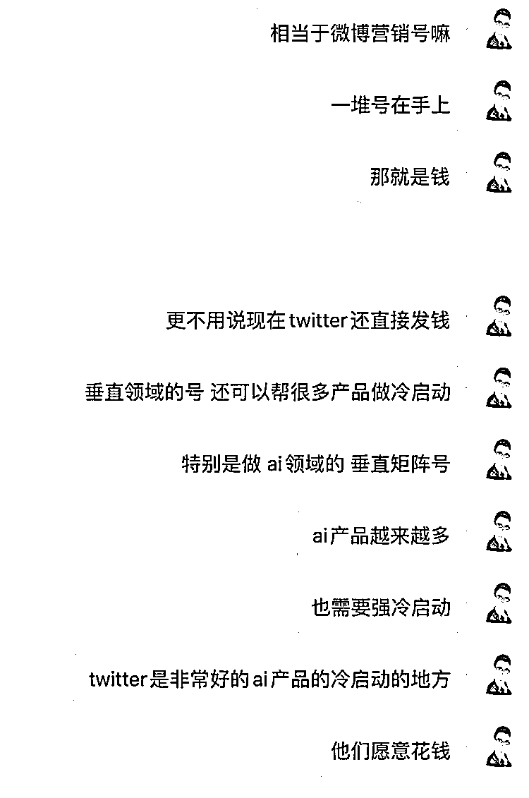

# 下次航海考虑使用 Twitter 矩阵号

> 原文：[`www.yuque.com/for_lazy/xkrm14/hx34vpnv1q0n4aqt`](https://www.yuque.com/for_lazy/xkrm14/hx34vpnv1q0n4aqt)

<ne-text id="u1164cd5c">作者： 亦仁</ne-text>

<ne-text id="ud6de6354">日期：2023-08-18</ne-text>

<ne-text id="ud1466e10">点赞数：</ne-text><ne-text id="u79d6f295" ne-bold="true">284</ne-text>

<ne-hole id="u638d258e" data-lake-id="u638d258e"><ne-card data-card-name="hr" data-card-type="block" id="eXX1O" data-event-boundary="card">

<ne-text id="u5cfc6ef4">正文：</ne-text>

<ne-text id="u6a0f1d62">嗯，下次航海考虑弄个 twitter 矩阵号。</ne-text>

<ne-card data-card-name="image" data-card-type="inline" id="a8E9f" data-event-boundary="card"></ne-card>

<ne-hole id="uce29f5f6" data-lake-id="uce29f5f6"><ne-card data-card-name="hr" data-card-type="block" id="WKNnk" data-event-boundary="card">

<ne-text id="u07ad7c42">评论区：</ne-text>

<ne-text id="u1de59539">易生 : 这</ne-text>

<ne-text id="u618b4f9d">深圳大冲 : 期待!</ne-text>

<ne-text id="u1fbfb7dd">豆哥 : 别下次啊。这次赶紧临时加上[流泪][流泪]</ne-text>

<ne-text id="u35887122">时习姥姥 : 好多🚢想上[流泪]</ne-text>

<ne-text id="ud1b5fd6b">玩转 ChatGPT : 这个好、期待下次航海一定要加上这个项目</ne-text>

<ne-text id="ue0be2f41">周彦充 : 这个好</ne-text>

<ne-text id="u448ccd34">张达达 : 别下次啊，就这次吧</ne-text>

<ne-text id="uecd16287">礼宸 : 下期可以赶得上[偷笑]</ne-text>

<ne-hole id="udad4265a" data-lake-id="udad4265a"><ne-card data-card-name="hr" data-card-type="block" id="KoORI" data-event-boundary="card">

<ne-text id="u237c969b">公众号懒人找资源，懒人专属群分享</ne-text>

</ne-card></ne-hole></ne-card></ne-hole></ne-card></ne-hole>