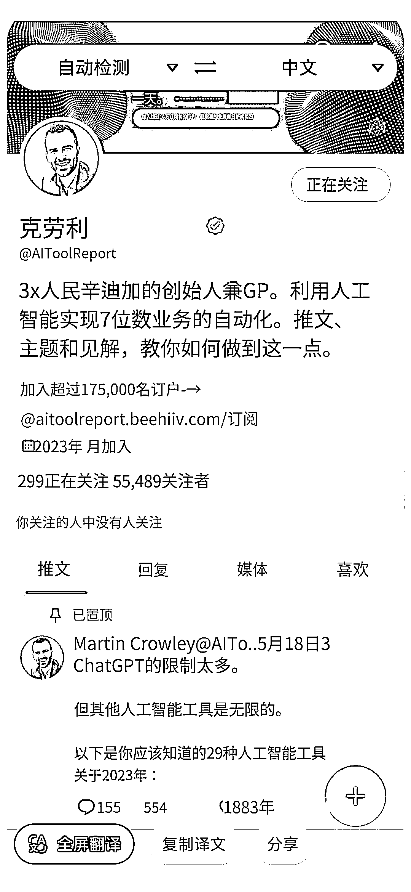
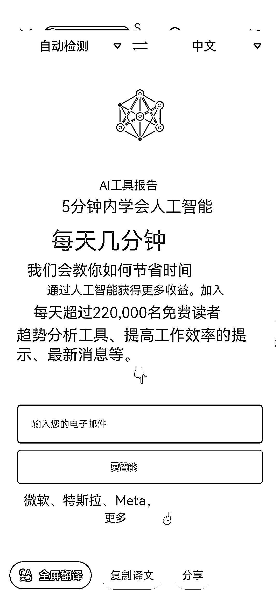

# 推特博主创办 AI 资讯网站，已有 17.5 万人加入，每月 15 美元收费

> 原文：[`www.yuque.com/for_lazy/xkrm14/vsbfvc8bgbnipkn1`](https://www.yuque.com/for_lazy/xkrm14/vsbfvc8bgbnipkn1)

作者： 张耑一

日期：2023-08-14

点赞数：97

正文：

这个推特博主创建了一个 AI 资讯网站， 每天推送各种 AI 的最新信息。 目前已有 17.5 万人加入，网站一个月收费 15 美金。下面附上中英文图片对照。

评论区：

波叔 : 厉害了[强][强]

朱朱侠 : 钢材信息，农产品信息，现在是 ai 信息，还有哪些类别没有被满足的呢，做一个试试看呗

芷蓝 : 还可以搞一个 ai 的导航站，我几年前运营的导航站依然还有收入，这个就是长期运营，权重上去了，广告位或者卖知识付费产品都能变现👍

潮州痞子蔡 : 导航站里面不要仅仅是广告变现，还是要增加更多强变现的内购产品，比如当年的贷款超市

詹伟平 : 这个国内相当于是做个付费的知识星球了，订阅行业咨询

Alex : 🎉🎉🎉

华一 : 想投广告[呲牙]

公众号懒人找资源，懒人专属群分享

