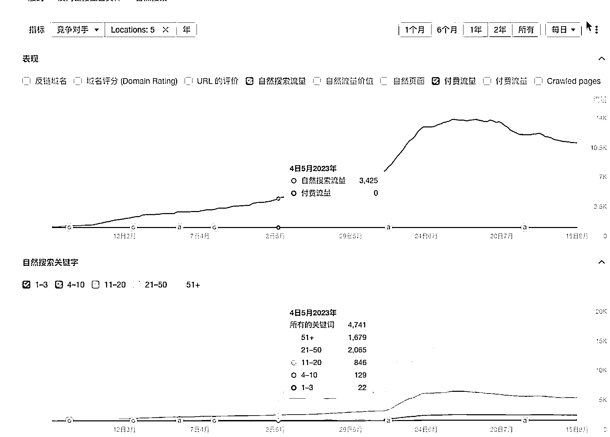
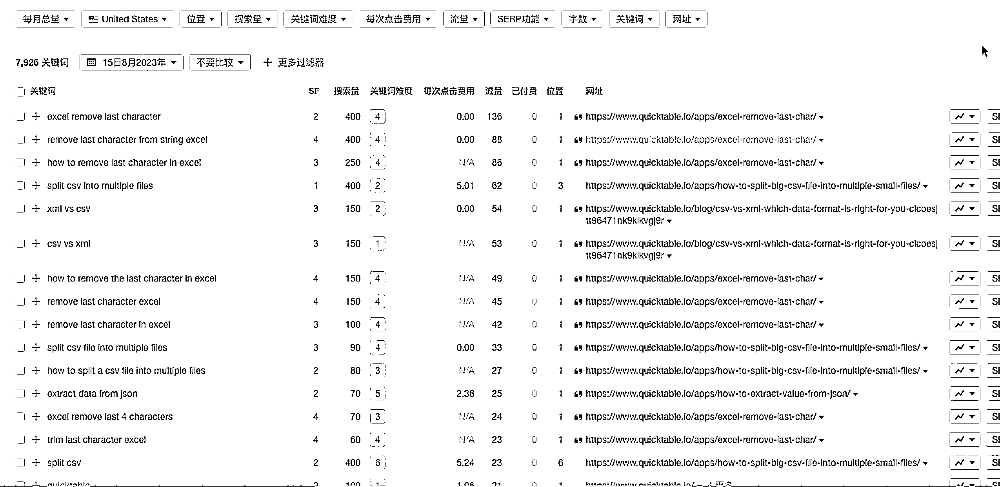

# 海外免费小工具矩阵起量的三个关键要点

> 原文：[`www.yuque.com/for_lazy/xkrm14/qnkxukocpgitqvba`](https://www.yuque.com/for_lazy/xkrm14/qnkxukocpgitqvba)

<ne-text id="ua65f12a0">作者： 胡二虎🐯</ne-text>

<ne-text id="ufca2f918">日期：2023-08-15</ne-text>

<ne-text id="u07fd2ba9">点赞数：</ne-text><ne-text id="uee99c41e" ne-bold="true">91</ne-text>

<ne-hole id="u1b508f8b" data-lake-id="u1b508f8b"><ne-card data-card-name="hr" data-card-type="block" id="IBtoo" data-event-boundary="card">

<ne-text id="ubfd81cfa">正文：</ne-text>

<ne-text id="u2d574b05">海外免费小工具矩阵起量的手段从 20 年开始就有玩家一直玩。</ne-text> <ne-text id="ucba9f8a1">国内也有人把这个小工具矩阵起量的手段玩的不错，Quicktable 这个站点就是国内一家团队做的，思路确实非常不错，从 0 到 1 做出几十万的流量，这里边三个要点</ne-text> <ne-text id="u9bde6452">1\. 首先是挖掘批量的蓝海词，没有批量的蓝海词，就没有小工具的矩阵。</ne-text> <ne-text id="u8df02264">2.小工具直接配置在页面上，一方面用户在页面上使用工具，增加了页面的停留时间，从而促进了页面排名和权重增长。一方面排名增长后的流量，又带来了更多使用工具的人。</ne-text> <ne-text id="ue6cc3f53">3.免费小工具的使用人群和主要产品的使用人群一致，保证付费的转化链路顺畅。</ne-text>

<ne-card data-card-name="image" data-card-type="inline" id="rmZIq" data-event-boundary="card"></ne-card>

<ne-card data-card-name="image" data-card-type="inline" id="ouywO" data-event-boundary="card"></ne-card>

<ne-hole id="ua1414362" data-lake-id="ua1414362"><ne-card data-card-name="hr" data-card-type="block" id="y9ouc" data-event-boundary="card">

<ne-text id="uf1625143">评论区：</ne-text>

<ne-text id="u3f31bb06">Fur Elise : 这种工具矩阵是怎么变现呢？</ne-text>

<ne-text id="uf9d2c25b">胡二虎🐯 : 第三点写了，免费小工具引流，主要产品变现</ne-text>

<ne-text id="ua8bdd3d5">胡二虎🐯 : 当然这只是主流的玩法。只要有流量，变现的方式太多了，广告，卖站，都行</ne-text>

<ne-text id="u94956822">潮州痞子蔡 : 一般是广告变现，但广告实际是互联网变现里面利润最差的一种，所以有其它方式可以验证就最好了</ne-text>

<ne-text id="uddce81ef">胡二虎🐯 : [强]</ne-text>

<ne-text id="uf320871b">骑车上天桥 : 请教下挖掘批量的蓝海词，这个有啥操作方式？</ne-text>

<ne-text id="u6886ac82">胡二虎🐯 : 很多种方法。去把 Semrush，Ahrefs 的博客看一遍，就懂了</ne-text>

<ne-hole id="u3a05b580" data-lake-id="u3a05b580"><ne-card data-card-name="hr" data-card-type="block" id="MUFXY" data-event-boundary="card">

<ne-text id="ufe42e2af">公众号懒人找资源，懒人专属群分享</ne-text>

</ne-card></ne-hole></ne-card></ne-hole></ne-card></ne-hole>