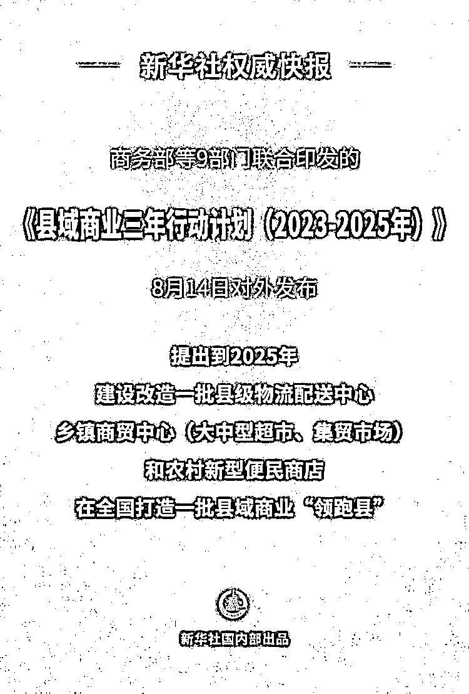

# 《县域商业三年行动计划（2023-2025 年）》，打造领跑县，实现村村通快递

> 原文：[`www.yuque.com/for_lazy/xkrm14/hz71cibpow0k71ef`](https://www.yuque.com/for_lazy/xkrm14/hz71cibpow0k71ef)

<ne-p id="u3bccbc05" data-lake-id="u3bccbc05"><ne-text id="u55c4096b">作者： 蛋蛋。</ne-text></ne-p> <ne-p id="udf3aaf71" data-lake-id="udf3aaf71"><ne-text id="ub8357755">日期：2023-08-14</ne-text></ne-p> <ne-p id="ud23e7976" data-lake-id="ud23e7976"><ne-text id="u26717366">点赞数：</ne-text><ne-text id="u8f966a4b" ne-bold="true">70</ne-text></ne-p> <ne-hole id="u8559c59d" data-lake-id="u8559c59d"><ne-card data-card-name="hr" data-card-type="block" id="Z48KP" data-event-boundary="card"><ne-p id="udc266f73" data-lake-id="udc266f73"><ne-text id="u06e06bd0">正文：</ne-text></ne-p> <ne-p id="uc1060b80" data-lake-id="uc1060b80"><ne-text id="u02fcbe9a">商务部等 9 部门联合印发的《县域商业三年行动计划（2023-2025 年）》14 日对外发布。计划提出，到 2025 年，在全国打造一批县域商业“领跑县”，90%的县达到“基本型”及以上商业功能，具备条件的地区基本实现村村通快递。</ne-text> <ne-text id="ud0638a03">这妥妥的就是下一步生财的风向啊</ne-text> [<ne-text id="uc735d8da">我国全面推进县域商业三年行动</ne-text>](https://mp.weixin.qq.com/s/d7r_AUeHl3AOjZeFfXTJRQ)</ne-p> <ne-p id="udce6fd9b" data-lake-id="udce6fd9b"><ne-card data-card-name="image" data-card-type="inline" id="wgcL7" data-event-boundary="card"></ne-card></ne-p> <ne-hole id="ua1564cbc" data-lake-id="ua1564cbc"><ne-card data-card-name="hr" data-card-type="block" id="qsycY" data-event-boundary="card"><ne-p id="u4703a6fc" data-lake-id="u4703a6fc"><ne-text id="ud5b994a0">评论区：</ne-text></ne-p> <ne-p id="udd45a49b" data-lake-id="udd45a49b"><ne-text id="u68a35f30">波叔 : 机会多</ne-text></ne-p> <ne-p id="u9f029c78" data-lake-id="u9f029c78"><ne-text id="u4aa6d9b5">朱朱侠 : 哪位大佬可以解读一下这个政策的信息</ne-text></ne-p> <ne-p id="u7f229a4e" data-lake-id="u7f229a4e"><ne-text id="u3d20dd2b">Alex : 🎉🎉🎉</ne-text></ne-p> <ne-hole id="uefd1768c" data-lake-id="uefd1768c"><ne-card data-card-name="hr" data-card-type="block" id="BcaMS" data-event-boundary="card"><ne-p id="u6a391fe7" data-lake-id="u6a391fe7"><ne-text id="u5a562830">公众号懒人找资源，懒人专属群分享</ne-text></ne-p></ne-card></ne-hole></ne-card></ne-hole></ne-card></ne-hole>