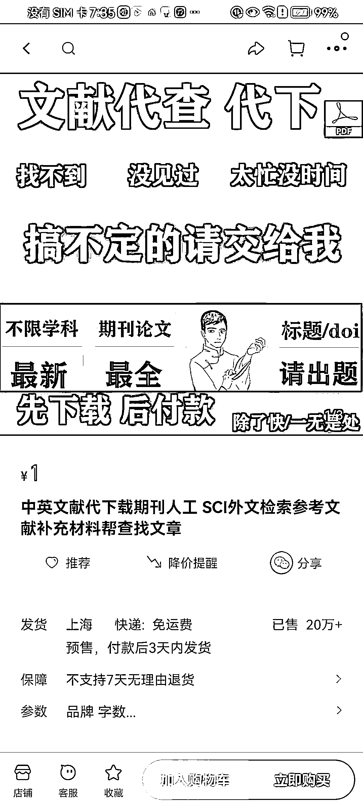

# 大学生利用学校资源库，论文代下载需求大增

> 原文：[`www.yuque.com/for_lazy/xkrm14/vnyezzxxwc00mq1c`](https://www.yuque.com/for_lazy/xkrm14/vnyezzxxwc00mq1c)

<ne-p id="u07bd984d" data-lake-id="u07bd984d"><ne-text id="u7af7523e">作者： 陈拓</ne-text></ne-p> <ne-p id="u1e7deb2c" data-lake-id="u1e7deb2c"><ne-text id="u16a3b0b1">日期：2023-08-17</ne-text></ne-p> <ne-p id="u3597fc9e" data-lake-id="u3597fc9e"><ne-text id="u4f970042">点赞数：</ne-text><ne-text id="ub57127ed" ne-bold="true">87</ne-text></ne-p> <ne-hole id="u06a6dbaf" data-lake-id="u06a6dbaf"><ne-card data-card-name="hr" data-card-type="block" id="X1Jf3" data-event-boundary="card"><ne-p id="uca40403a" data-lake-id="uca40403a"><ne-text id="u312bf6af">正文：</ne-text></ne-p> <ne-p id="ud1139102" data-lake-id="ud1139102"><ne-text id="u45828094">论文代下载这个业务没想到需求这么大。作为一个前科研人员，经常在群里看到有人需要下载论文，但是没想到要做这个。个人感觉十分适合大学生，尤其是名校大学生，因为好大学基本上所有数据库都买了，可以算是零成本项目。利用好学校的资源库。</ne-text></ne-p> <ne-p id="u479c34f4" data-lake-id="u479c34f4"><ne-card data-card-name="image" data-card-type="inline" id="dOdPZ" data-event-boundary="card"></ne-card></ne-p> <ne-hole id="u68e92b9c" data-lake-id="u68e92b9c"><ne-card data-card-name="hr" data-card-type="block" id="LGG8w" data-event-boundary="card"><ne-p id="ued63ee52" data-lake-id="ued63ee52"><ne-text id="ue87f9d07">评论区：</ne-text></ne-p> <ne-p id="u6413bbeb" data-lake-id="u6413bbeb"><ne-text id="u624d79cc">枫晓陌 : 真牛🐮 学到了</ne-text></ne-p> <ne-p id="u05115902" data-lake-id="u05115902"><ne-text id="u477a5d5e">小西瓜 : 怎么下载的呀</ne-text></ne-p> <ne-p id="u8dde1208" data-lake-id="u8dde1208"><ne-text id="uac52f9a6">isen : 我们大学论文都是买了的，可以直接下载导出</ne-text></ne-p> <ne-p id="uebc3d93b" data-lake-id="uebc3d93b"><ne-text id="u8eb13133">Alex : 🎉🎉🎉</ne-text></ne-p> <ne-hole id="uc2e8ab5a" data-lake-id="uc2e8ab5a"><ne-card data-card-name="hr" data-card-type="block" id="OMWyc" data-event-boundary="card"><ne-p id="ub66904fe" data-lake-id="ub66904fe"><ne-text id="ueeed9bb4">公众号懒人找资源，懒人专属群分享</ne-text></ne-p></ne-card></ne-hole></ne-card></ne-hole></ne-card></ne-hole>