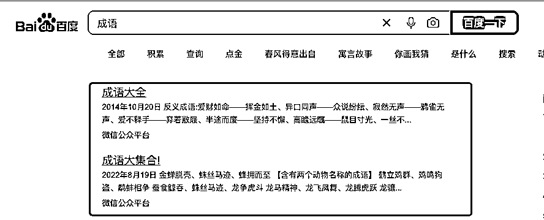

# 百度 SEO 关键：分门别类罗列成语，提高搜索排名

> 原文：[`www.yuque.com/for_lazy/xkrm14/sg7fr01k5pq2c1dx`](https://www.yuque.com/for_lazy/xkrm14/sg7fr01k5pq2c1dx)

<ne-p id="u3efe42db" data-lake-id="u3efe42db"><ne-text id="u11e9e6b6">作者： 哥飞</ne-text></ne-p> <ne-p id="u11b585ae" data-lake-id="u11b585ae"><ne-text id="ue21add91">日期：2023-08-14</ne-text></ne-p> <ne-p id="u9af7c6f0" data-lake-id="u9af7c6f0"><ne-text id="uc18458b1">点赞数：</ne-text><ne-text id="u33cbbfda" ne-bold="true">67</ne-text></ne-p> <ne-hole id="ued54dbd7" data-lake-id="ued54dbd7"><ne-card data-card-name="hr" data-card-type="block" id="szecZ" data-event-boundary="card"><ne-p id="u893dd9b2" data-lake-id="u893dd9b2"><ne-text id="u87f3256d">正文：</ne-text></ne-p> <ne-p id="u95960e10" data-lake-id="u95960e10"><ne-text id="u8354acaa">搜索成语两个字，百度第一页结果，有两篇公众号文章，一篇 2014 年发布的，一篇 2022 年发布的。 这两篇都有个特点，就是文章内分门别类罗列了大量成语。</ne-text> <ne-text id="u455b0a4a">注意精髓有两个： 一是要分门别类； 二是要罗列成语。 基本你揣摩明白了这两点，百度 SEO 就会做了。</ne-text></ne-p> <ne-p id="u4b3bf64a" data-lake-id="u4b3bf64a"><ne-card data-card-name="image" data-card-type="inline" id="tqgJE" data-event-boundary="card"></ne-card></ne-p> <ne-p id="ubcb1f16c" data-lake-id="ubcb1f16c"><ne-card data-card-name="image" data-card-type="inline" id="XCECX" data-event-boundary="card"></ne-card></ne-p> <ne-hole id="u125f05e8" data-lake-id="u125f05e8"><ne-card data-card-name="hr" data-card-type="block" id="hW0wE" data-event-boundary="card"><ne-p id="ua20ab10a" data-lake-id="ua20ab10a"><ne-text id="u4e0d6223">评论区：</ne-text></ne-p> <ne-p id="u97d64b1d" data-lake-id="u97d64b1d"><ne-text id="uf67d3cdb">希平 : 你把百度看的太简单了</ne-text></ne-p> <ne-p id="uc9c9eee7" data-lake-id="uc9c9eee7"><ne-text id="u8c9ef5e5">哥飞 : 你把百度想得太复杂了。我用这个方法做过，所以总结了这个方法。然后又看到有公众号文章，也是这个规律，而且一篇 2014，一篇 2022，都有用，所以才发的这个风向标。</ne-text> <ne-text id="uaf340be2">我们常说内容为王，外链为皇，两者缺一不可。那内容怎么做？就可以按照我总结的这个规律来。</ne-text></ne-p> <ne-p id="uaf6d7d45" data-lake-id="uaf6d7d45"><ne-text id="u068ce653">Alex : 🎉🎉🎉</ne-text></ne-p> <ne-p id="uff878f4c" data-lake-id="uff878f4c"><ne-text id="u27293c6f">波哥 : 感谢分享， 不过按照你的方法去百度首页去搜‘成语’，没搜到这 2 篇文章，搜出来的大部分都是自己的网站</ne-text></ne-p> <ne-p id="u4f74c1bd" data-lake-id="u4f74c1bd"><ne-text id="u2f73a1ee">哥飞 : 你用电脑搜索还是手机搜索的？我这里电脑搜索，这篇文章就在百科下面。</ne-text></ne-p> <ne-p id="u20a9f3a4" data-lake-id="u20a9f3a4"><ne-text id="u9ac035c0">波哥 : 找到了，电脑网页版， 得往下去刷才能找到。不是在头部</ne-text></ne-p> <ne-hole id="u61e0bfdc" data-lake-id="u61e0bfdc"><ne-card data-card-name="hr" data-card-type="block" id="t2Uds" data-event-boundary="card"><ne-p id="u551e1514" data-lake-id="u551e1514"><ne-text id="u7cacdf0b">公众号懒人找资源，懒人专属群分享</ne-text></ne-p></ne-card></ne-hole></ne-card></ne-hole></ne-card></ne-hole>