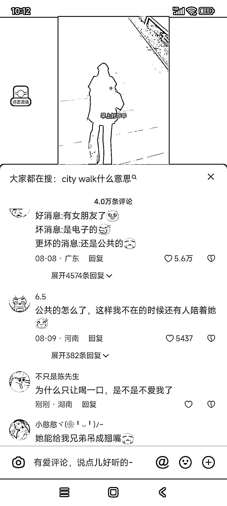
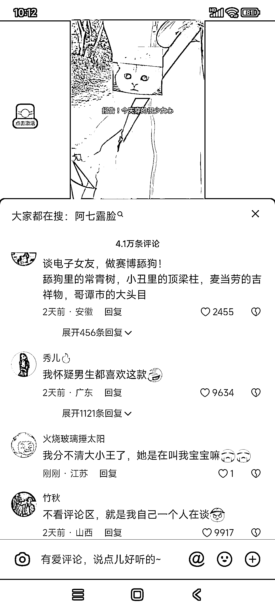

# 电子伴侣市场需求大，抖音账号打造电子女友引关注

> 原文：[`www.yuque.com/for_lazy/xkrm14/fgpbafbtwq2fmgqp`](https://www.yuque.com/for_lazy/xkrm14/fgpbafbtwq2fmgqp)

<ne-p id="u5a14bb5d" data-lake-id="u5a14bb5d"><ne-text id="u26c9a676">作者： 豆豆</ne-text></ne-p> <ne-p id="u5e2640a0" data-lake-id="u5e2640a0"><ne-text id="u4e2c2805">日期：2023-08-14</ne-text></ne-p> <ne-p id="u30d5a490" data-lake-id="u30d5a490"><ne-text id="u41b088b5">点赞数：</ne-text><ne-text id="ude2af58c" ne-bold="true">57</ne-text></ne-p> <ne-hole id="uf95a5a48" data-lake-id="uf95a5a48"><ne-card data-card-name="hr" data-card-type="block" id="Y1ckV" data-event-boundary="card"><ne-p id="ufbb69911" data-lake-id="ufbb69911"><ne-text id="u11036f90">正文：</ne-text></ne-p> <ne-p id="uccdce192" data-lake-id="uccdce192"><ne-text id="udcefb628">电子女友，电子老婆，电子老公，电子男友，都是很大的市场需求。</ne-text> <ne-text id="u8157fdbe">下图账号，抖音本周获关注 top50，昨日获赞 50W+，最近一个月的视频好到爆，每天几十万点赞，打造的人设:电子女友，看出年轻一代的恋爱观和之前的已大不相同。</ne-text> <ne-text id="u966dba4c">多重变现手段，每晚直播打赏，专属会员收益，4 个粉丝群，其中两个已满员，橱窗带货，变现天花板很高。</ne-text></ne-p> <ne-p id="u60f330ba" data-lake-id="u60f330ba"><ne-card data-card-name="image" data-card-type="inline" id="VBeCn" data-event-boundary="card"></ne-card></ne-p> <ne-p id="u970026b3" data-lake-id="u970026b3"><ne-card data-card-name="image" data-card-type="inline" id="jB5Hz" data-event-boundary="card"></ne-card></ne-p> <ne-p id="u95a83bd7" data-lake-id="u95a83bd7"><ne-card data-card-name="image" data-card-type="inline" id="WxhhJ" data-event-boundary="card"></ne-card></ne-p> <ne-p id="u071e0774" data-lake-id="u071e0774"><ne-card data-card-name="image" data-card-type="inline" id="RZ1IY" data-event-boundary="card"></ne-card></ne-p> <ne-p id="u22cb66b6" data-lake-id="u22cb66b6"><ne-card data-card-name="image" data-card-type="inline" id="CPSfO" data-event-boundary="card"></ne-card></ne-p> <ne-p id="ua5a4f22c" data-lake-id="ua5a4f22c"><ne-card data-card-name="image" data-card-type="inline" id="RLIeq" data-event-boundary="card"></ne-card></ne-p> <ne-hole id="ua6ac1437" data-lake-id="ua6ac1437"><ne-card data-card-name="hr" data-card-type="block" id="IFHdD" data-event-boundary="card"><ne-p id="u86387cf2" data-lake-id="u86387cf2"><ne-text id="u3d4c5001">评论区：</ne-text></ne-p> <ne-hole id="uc556035b" data-lake-id="uc556035b"><ne-card data-card-name="hr" data-card-type="block" id="fxerW" data-event-boundary="card"><ne-p id="u97be2f99" data-lake-id="u97be2f99"><ne-text id="u67c67a6d">公众号懒人找资源，懒人专属群分享</ne-text></ne-p></ne-card></ne-hole></ne-card></ne-hole></ne-card></ne-hole>