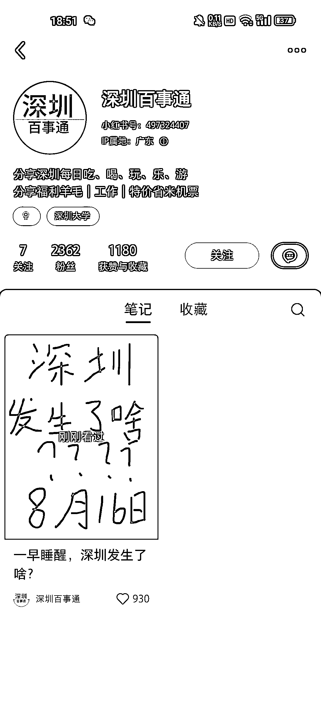

# 接地气的实惠生活指南，直接领取折现优惠

> 原文：[`www.yuque.com/for_lazy/xkrm14/zc1rltnc8s8dhqrl`](https://www.yuque.com/for_lazy/xkrm14/zc1rltnc8s8dhqrl)

作者： Choco

日期：2023-08-16

点赞数：77

正文：

就这一条就涨了两千多粉，这个和之前信息差不一样的点就是接地气，把周边活动，薅羊毛，机票这类生活中可以直接"折现"的点给指出来，让大家直接领取到"实惠"，不像之前的信息差做的都是新闻信息类，这个有点像之前贴在小区里的那种广告的信息合集，变现最直接的就是接广，还能做那种付费信息共享社群……

评论区：

王闪闪 : 我想请问一下这种信息从哪里搜集的呀～

涟漪 : 我想请问一下这种信息从哪里搜集的呀～+1

鲁西西 : 同问

Choco : 具体在哪找我也不清楚，得自己摸索，这个也属于信息差

Choco : 具体在哪找我也不清楚，得自己摸索，这个也属于信息差

鲁西西 : [苦涩][苦涩][苦涩]

小马哥 xy50 : 这种本身他们有做本地类的账号，并不是单纯做小红书的，因为他们会放一些这类的优惠活动发公众号

公众号懒人找资源，懒人专属群分享

