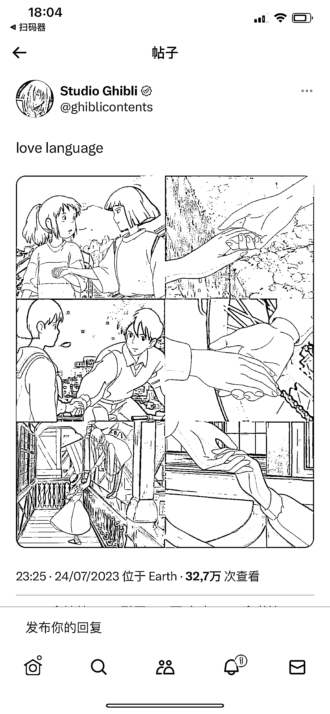
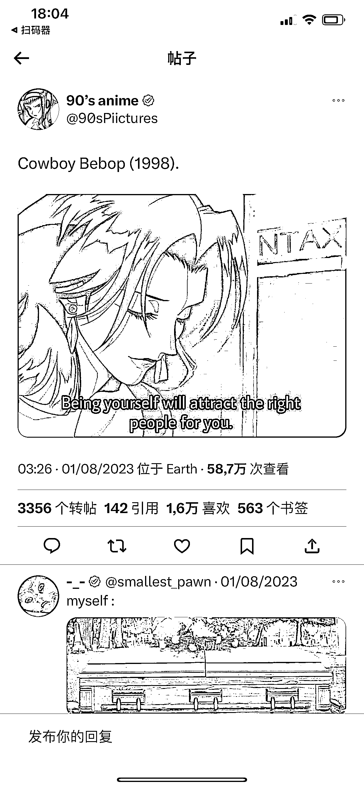

# 推特上火的日漫图片号，适合矩阵和动漫迷对标学习

> 原文：[`www.yuque.com/for_lazy/xkrm14/xt61yfi80gyu4w9z`](https://www.yuque.com/for_lazy/xkrm14/xt61yfi80gyu4w9z)

作者： 林元陸

日期：2023-08-18

点赞数：177

正文：

推特上火了好几年的一种图片号，很适合有能力做矩阵或本身就是动漫迷的圈友对标学习一下。 八九十年代的日漫截图加上颇具哲理的英文金句，整个账号内容的仪式感与高级感瞬间不知道 up 了多少个层次，不少账号阅读量都是五万起步，至于几十万上百万的流量也不是不可能了。 感兴趣的圈友，也不妨试试看在微博、小红书、抖音等平台抄他们的作业，搞出一个很讲究调性的自媒体账号，满足广大网友装 X 的需求，从而躺赚更多流量收益。

评论区：

阿涛 jacktao : 抖音小红书感觉可以试试。 但我觉得小红书的空间会不会更大，因为以内容为主的。

Alex : 🎉🎉🎉

公众号懒人找资源，懒人专属群分享

