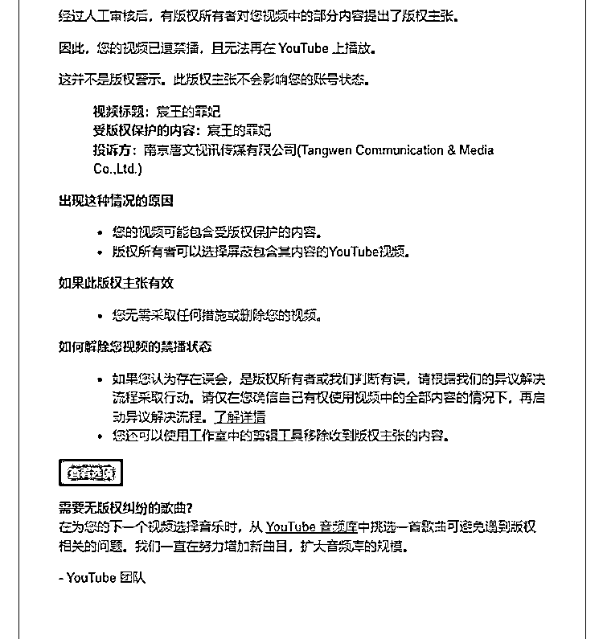

# 油管国内短剧项目需获得版权，否则将被下架

> 原文：[`www.yuque.com/for_lazy/xkrm14/pla4lgip65lcdem0`](https://www.yuque.com/for_lazy/xkrm14/pla4lgip65lcdem0)

作者： 龙王

日期：2023-08-16

点赞数：91

<ne-hole id="u2b71324a" data-lake-id="u2b71324a"><ne-card data-card-name="hr" data-card-type="block" id="lOX2W" data-event-boundary="card">

正文：

油管做国内短剧项目的，没有获得版权的会被下架！有做短剧岀海的圈友，注意啦！

<ne-card data-card-name="image" data-card-type="inline" id="ojwfW" data-event-boundary="card"></ne-card>

<ne-hole id="u65bc5e7a" data-lake-id="u65bc5e7a"><ne-card data-card-name="hr" data-card-type="block" id="m40sg" data-event-boundary="card">

评论区：

龙王 : [憨笑]自己踩的坑，竟然中标！谢谢老大

毛豆 : 是上传的时候就版权主张了，还是视频发布一段时间后，版权方来投诉的？

西昂 : 一般上传后，会机器审核。然后就会提示了。

龙王 : 发布很久了，上次是航海发了一条，这次才被举报

<ne-hole id="u830ecda4" data-lake-id="u830ecda4"><ne-card data-card-name="hr" data-card-type="block" id="FuY3x" data-event-boundary="card">

公众号懒人找资源，懒人专属群分享

</ne-card></ne-hole></ne-card></ne-hole></ne-card></ne-hole>