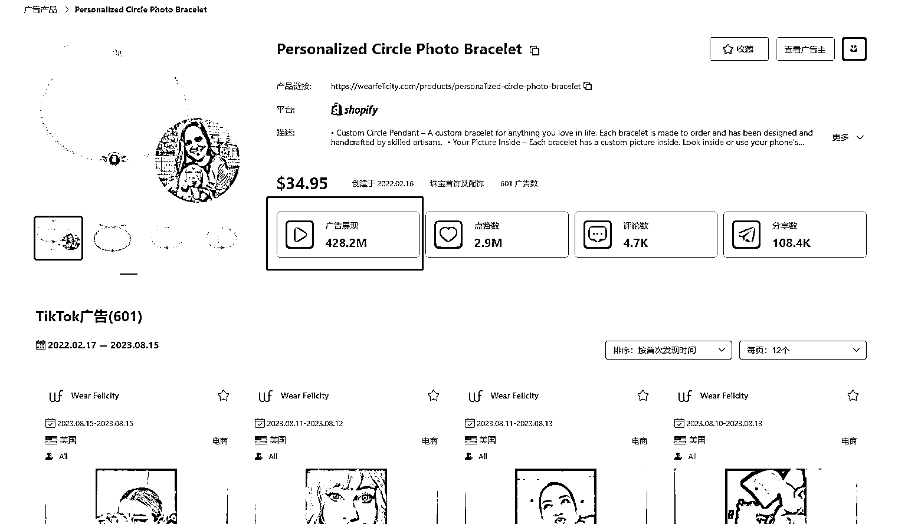
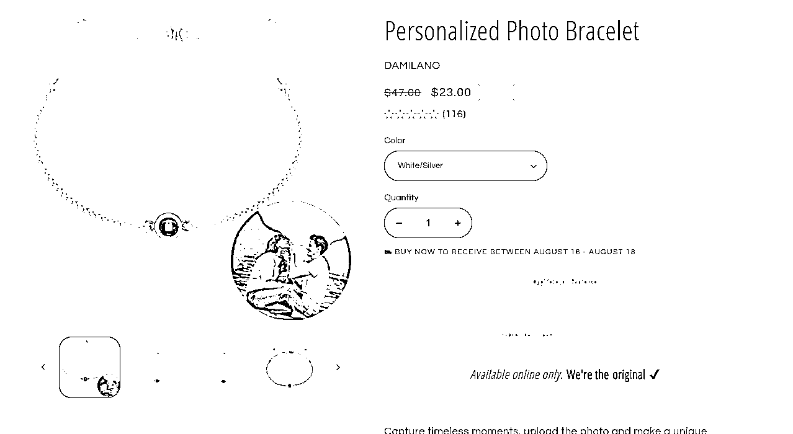

# Tiktok 再爆一次的创意饰品，投影石手链成现象级爆款

> 原文：[`www.yuque.com/for_lazy/xkrm14/psdr0p7w95ynt7li`](https://www.yuque.com/for_lazy/xkrm14/psdr0p7w95ynt7li)

作者： Max

日期：2023-08-15

点赞数：97

正文：

很多在国内爆过的创意类饰品，都可以 1:1 在 Tiktok 再爆一次。 这条投影石手链，在 tiktok 跑了 4 亿 2800 万播放量，是现象级爆款。1688 拿货价 5.6，独立站上售价 20 多刀。 打的人群很广泛，情侣、家人、宠物、朋友等等。 须知：独立站流量来源 95%以上来自于 tiktok、google，facebook 等平台的广告投放（甚至更多）。拿美国举例，现在在 tt 正常投饰品类目的话，买一个转化得到 12-15 刀左右，这算是正常水平。投流获客成本占了大头，所以其实也并不像很多营销号描述的那样纯利高达 80%。 由于 tiktok 靠邮箱就能注册，所以人群画像对比起抖音精准度还是相差很多。所以跑不爆的情况下，大部分投 TTads 的人还是在亏钱。投放 5 分选品，3 分运气，2 分技巧。最重要的还是选品。加油跨境人！！！

评论区：

W.Z.Y : 自然流量吃点肉，投放纯亏，目前来说 ADS 还没跑好的商家出现

Max : 跑爆品可以的，白牌玩家真的很难玩

Max : 谢谢老大

||  AB : 我搜了下，似乎这个是有专利的？

Max : 据我了解到是没有的，很多饰品礼品独立站都有类似的产品

如也 : 时代的眼泪阿 18 年做淘宝饰品时候的爆款了

Max : 所以说蛮多国内的爆品都可以再国外再来一遍

公众号懒人找资源，懒人专属群分享

