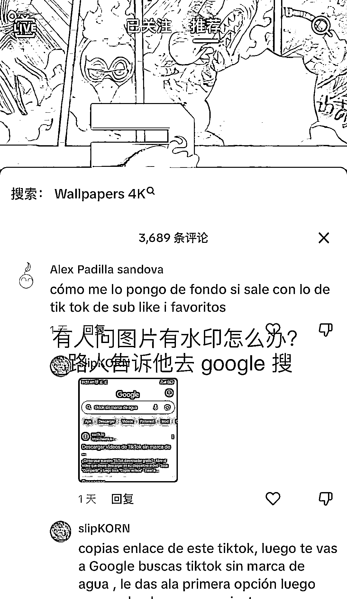

# 国内火的东西在国外也有市场，TikTok 和 Instagram 是分发的好平台

> 原文：[`www.yuque.com/for_lazy/xkrm14/gc5bbg7gz5s23zr9`](https://www.yuque.com/for_lazy/xkrm14/gc5bbg7gz5s23zr9)

作者： 郭小帅

日期：2023-08-15

点赞数：82

<ne-hole id="u731378ec" data-lake-id="u731378ec">

正文：

上面看到一个圈友发的风向标是黑人生日祝福的，给我的启发是一个东西在国内火了之后，大概率国外也有同样的需求，也可以在国外平台分发，比如 TikTok、Instagram 等等 然后我早上刷 TikTok 就刷到个壁纸号，给大家个参考类目，比如动漫的，海贼王、火影忍者这些动漫在国外也很火好看的壁纸也是有市场的 这里给大家提供个参考的账号，取原图引到 ins、或者 YouTube. 然后我去看了他的频道，频道也不能取图，他是告诉你个工具站，下载 TikTok 视频去水印的😂😂 这一下子提供了 2 个思路：一个是壁纸号，一个是 TikTok 去水印工具站. 评论区也有人说图片有水印，还有路人告诉他去 google 搜去水印，看来这个博主自己没做好啊，评论区都不置顶引流的么😅😅，看到这个圈友们是不对国外更有信心了

<ne-hole id="uccb4e692" data-lake-id="uccb4e692">

评论区：

郭小帅 : 谢谢老大

Alex : 恭喜恭喜

<ne-hole id="u0c40ea64" data-lake-id="u0c40ea64">

公众号懒人找资源，懒人专属群分享

</ne-hole></ne-hole></ne-hole>