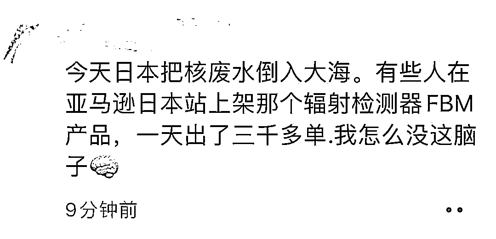

# 亚马逊日本站核辐射检测仪一天出了 3000 单，国内市场或将迎来需求上涨

> 原文：[`www.yuque.com/for_lazy/xkrm14/fci2dpp5b5awhf2u`](https://www.yuque.com/for_lazy/xkrm14/fci2dpp5b5awhf2u)

作者： Max

日期：2023-08-24

点赞数：**173**

* * *

正文：

在朋友圈看到一条，亚马逊日本站核辐射检测仪一天出了 3000 单。 能赚到快钱的人往往是执行力很强的人。
今天盐在国内各个平台爆单了，照这个散播恐慌的速度，核辐射检测仪以及关于核废水排放衍生出来的其他直击痛点的产品，在国内也会迎来一波需求上涨

* * *

评论区：

林元陸 : 史上最快中标

波叔 : bussiness is business

戴巍 : 再看看检测仪主要哪家公司，股票估计会涨

* * *

公众号懒人找资源，懒人专属群分享