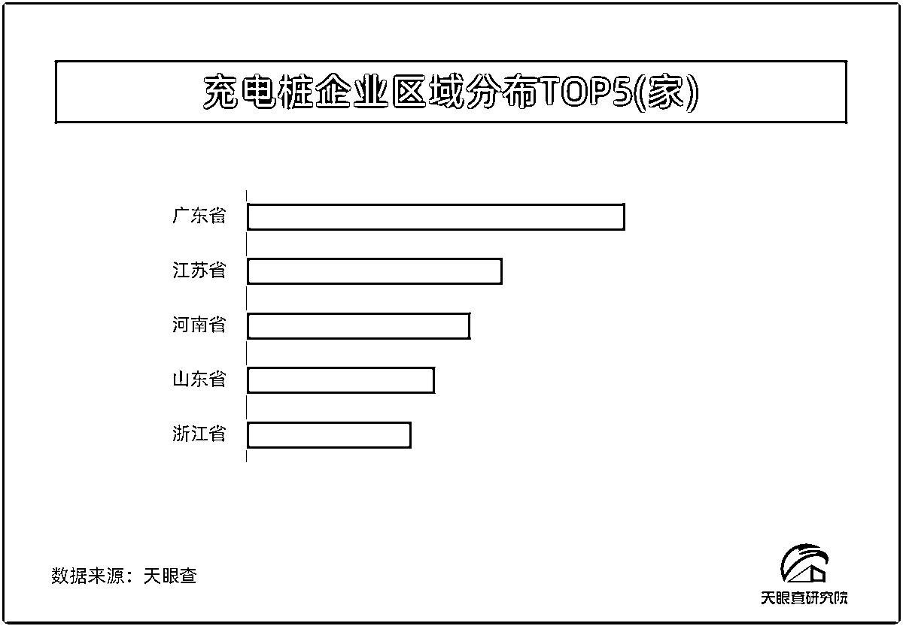

# 新能源汽车销量攀升，充电桩市场迎来蓝海机遇

> 原文：[`www.yuque.com/for_lazy/xkrm14/dfi3lq4zwrovspen`](https://www.yuque.com/for_lazy/xkrm14/dfi3lq4zwrovspen)

作者： 林元陸

日期：2023-08-23

点赞数：**76**

* * *

正文：

1、近日天眼查研究院发布的一份研究报告指出，随着多项利好政策的持续出台，新能源汽车销量不断攀升，对于充电桩的需求有望进一步放大，充电桩将是继加油站后的又一大蓝海市场。（个人建议：有实力的圈友，还是多多关注一下。）
2、报告指出，我国存在公共充电桩不足的结构性问题，公共补能仍存在较大缺口。
3、从数据上看，我国公共桩保有量从 2017 年的 21.4 万台增长至 2022 年的 179.7 万台，六年复合增长率达 53.05%；我国私人充电桩（随车配建）从 2017 年的 23.18 万台增长至 2022 年的 341.20 万台，复合增长率达 71.23%。
4、截至 2022 年，我国车桩比为 2.51：1，公共车桩比为 7.29：1，这距离工业和信息化部此前提出的“2025 年实现车桩比 2:1，2030 年实现车桩比 1:1”的目标仍有较大差距，并且具有明显的公共充电桩不足的结构性问题。
5、考虑到出租车、网约车等运营车辆每日行驶里程较长，有着高频使用公共充电桩的需求。再加上部分车主没有固定停车位，导致私人桩配建困难，私人车主仍然需要寻找公共充电桩进行日常的能源补给。
消息来源： [新能源汽车迅猛发展+带动充电桩需求快速增长*业界*科技频道首页 _ 财经网+-+CAIJING.COM....](http://tech.caijing.com.cn/20230823/4954826.shtml) 

* * *

评论区：

希平 : 充电桩是一个产业链了，比如充电协议、充电桩的布局什么的，但巨头再怎么强大，比如加油站、南方电网，都无法吃全部，到时做菜鸟驿站、洗车场、汽车 4S 店可以做一下充电桩，反正场地就在那里

 杰克船长 🍼 : 有没有做充电设备的厂家，我们有场地可以合作[微笑]

林元陸 : 你加下我，我有

十巷 : 怎么联系，我这边也有场地，在西安，之前做洗车的，效益不好就扔着没管了

林元陸 : 看我个人介绍

* * *

公众号懒人找资源，懒人专属群分享