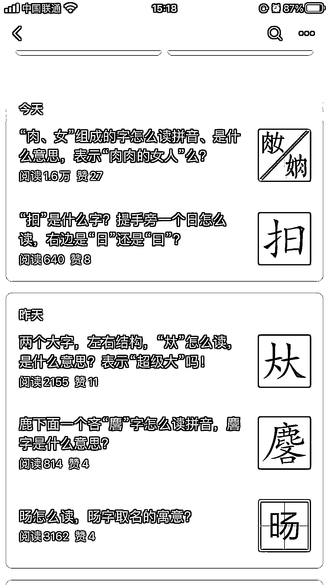

# 公众号流量主的细分领域：生僻字解读、科普，流量不错

> 原文：[`www.yuque.com/for_lazy/xkrm14/gspn44zc01y6hlxu`](https://www.yuque.com/for_lazy/xkrm14/gspn44zc01y6hlxu)

作者： 热心网友大表哥

日期：2023-08-29

点赞数：**94**

* * *

正文：

公众号流量主又一个细分领域：生僻字解读、科普，流量不错。 评论区请圈友们发挥一下还有什么领域？既细分，又不至于太小众的？

* * *

评论区：

热心网友大表哥 : 谢谢老大[玫瑰]

陈真 : 甲骨文

林元陸 : 7 月中旬才搞的，兴许是某位圈友的付费学员。

cui : 科普这个可以搞，但是我搞的是传统文化类科普，山、医、命、相、卜

热心网友大表哥 : [强][强]引流私域还可以变现吧[坏笑]

热心网友大表哥 : 也许是

热心网友大表哥 : 甲骨文也行，或者往书法方面延伸，还可以卖书法课[憨笑]

* * *

