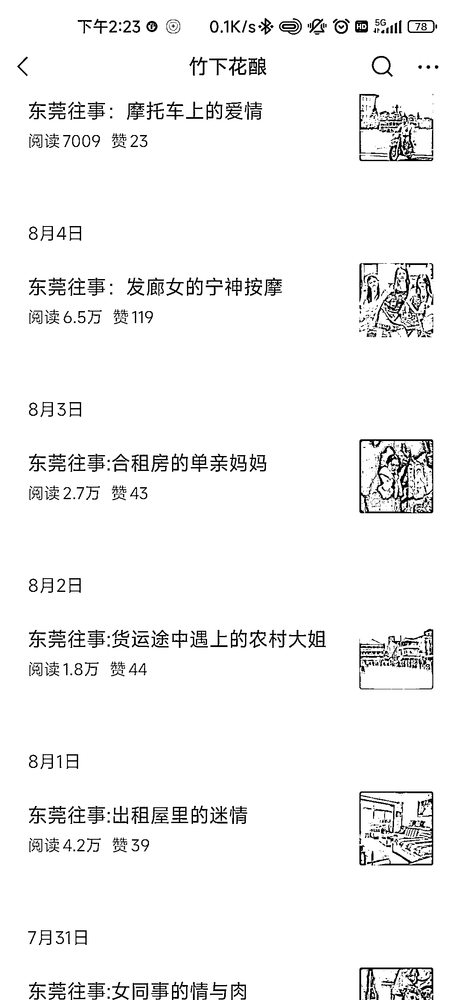

# 以东莞往事开头的公众号文章，吸引了数万读者的关注

> 原文：[`www.yuque.com/for_lazy/xkrm14/evd88q6x0sbh2hza`](https://www.yuque.com/for_lazy/xkrm14/evd88q6x0sbh2hza)

作者： 泛音

日期：2023-08-30

点赞数：**103**

* * *

正文：

公众号爆文标题：以东莞往事开头，7 月 21 号起号，到现在 32 篇原创文，文章阅读过万的 12 篇，4w 以上 3 篇，东莞作为世界工厂，南来北往的打工者络绎不绝，留下了很多回忆和故事，这种以东莞往事开头的文章，会让之前在东莞工作过的人群驻留观看。
之前看过的还有深圳往事，以此类推可以出很多以讲述城市陈年往事的同类型的号。

* * *

评论区：

泛音 : 谢谢老大，这个月中标两次了，开心😊

九歌 : 各种城市的往事都可以，关键素材来源不好找

七十七 : 用 Gpt 模仿生成，都是编造的，

泛音 : 对的，可以用 ai 来模仿，如果想贴合城市的话，可以去各大情感论坛去找下

九歌 : 😂😂😂开眼了

热心网友大表哥 : 最近几个月起号的我猜测都是模仿“三惊胖爷”这个号，七月初的时候我在风向标群里有提到过这种类型的号[旺柴]

泛音 : 大佬原来早就注意到这个题材了[呲牙]

* * *

公众号懒人找资源，懒人专属群分享