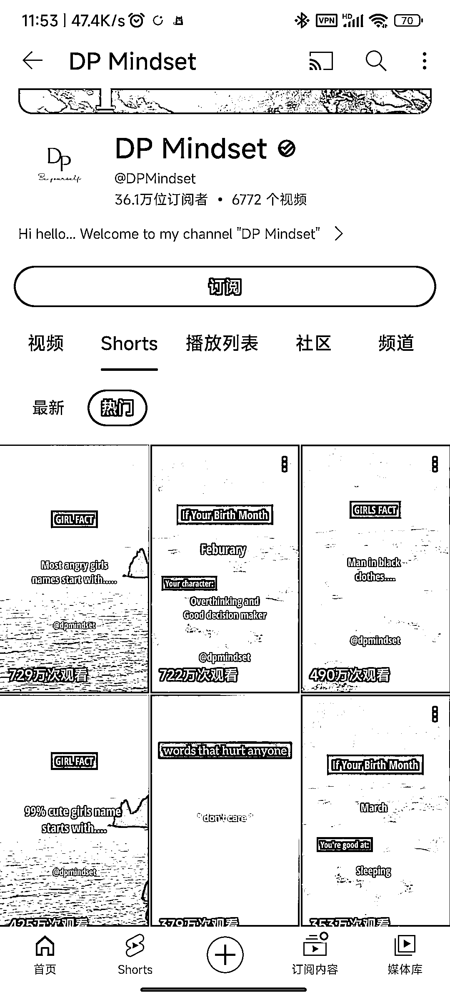
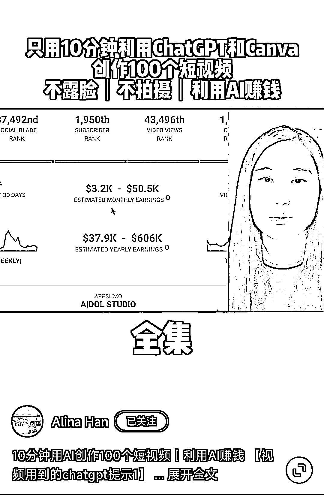

# 小红书拆解 youtube 账号，一个月 5 万刀收益

> 原文：[`www.yuque.com/for_lazy/xkrm14/udy8k2wkrh1tikax`](https://www.yuque.com/for_lazy/xkrm14/udy8k2wkrh1tikax)

作者： 书生

日期：2023-09-01

点赞数：**121**

* * *

正文：

不知道这个价值多少，刚刷到的一个小红书拆解的 yoube 账号，说一个月 5 万刀的收益，内容格式很简单，具体拆解过程可以看视频。 简单分析一下，
1、不要卷国内了，国外的情感领域也大有市场，2、另外用到的批量做视频工具很简单，做工具出海的可以尝试复制一下， 3、AI 的功能很强大，大家一定要用起来。

* * *

评论区：

郭小帅 : Mark 一下

亿白—深圳—终身学习 : 这个小红书视频有没有链接嘞，或者是哪个博主

书生 : 好了，和我说下，我要做测试用户

书生 : 号没打码，标题也有，应该能搜到吧

辉哥 : 看了这个拆解视频，视频制作是很简单，youtube 的账号我也去看了一下，我对于这个收益有很大的怀疑，因为这个频道大部分的视频是来自 shorts，我查了一下，目前 short 的收益是非常低的，所以这个账号不可能有这么高的收益

Javinlee : 分析 y2b 的收益是什么插件

昊布斯 : 这种视频我在 shorts 上传过两个，流量为 0，用的中文文案，视频也是中式禅意风格，看了这个博主的视频后，准备改成英文试试

* * *

