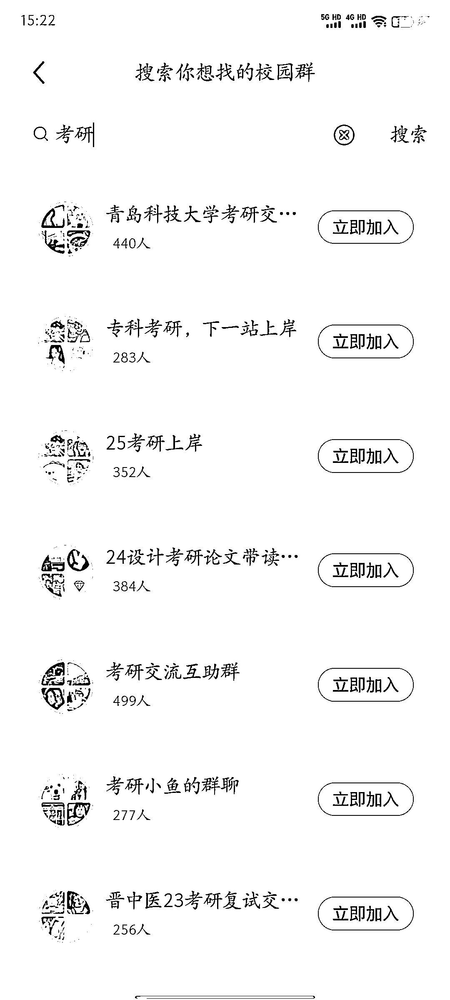

# 小红书新的流量洼地，适合虚拟资料和精准客户引流，尤其适合大学生相关领域

> 原文：[`www.yuque.com/for_lazy/xkrm14/loha2noptwnnvec8`](https://www.yuque.com/for_lazy/xkrm14/loha2noptwnnvec8)

作者： 凌霄

日期：2023-09-01

点赞数：**109**

* * *

正文：

小红书新的流量洼地，做虚拟资料和做精准客户引流的可以看看，尤其是做大学生相关的

* * *

评论区：

挖哈的阿抓 : 这个界面怎么找到呀

许山山 : 小红书搜索“迎新季”

Dream : 没看到可以搜索群的入口😂

* * *

公众号懒人找资源，懒人专属群分享