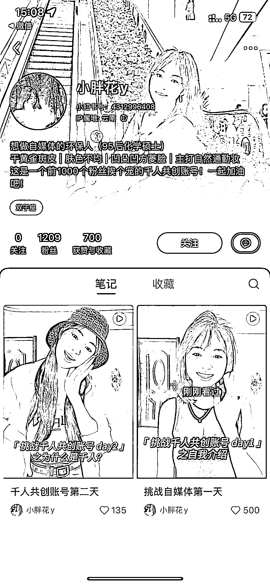

# 粉丝共创，打造私域流量新玩法

> 原文：[`www.yuque.com/for_lazy/xkrm14/eln6qipkihfmyxdz`](https://www.yuque.com/for_lazy/xkrm14/eln6qipkihfmyxdz)

作者： 英麒 Ryan

日期：2023-08-28

点赞数：**104**

* * *

正文：

做号新玩法，千粉共创 “云股东”概念再升级，套一个“粉丝共创”概念，博主日更发内容，然后粉丝做数据，到千粉之后，每接到广告，分一半费用给粉丝抽奖
这种概念应该很好转私域 链接： [挑战自媒体第一天](http://xhslink.com/lIi0Ut)

* * *

评论区：

何兮 : 真有意思

迷途小书童的 Note : 这个可行👍

一只鸵鸟 : 赞

卡里 : 感谢分享

Yao : 这个在国外叫 build in public

无盐 : 666

怪力小乔巴 : 这个概念还真是新颖

* * *

