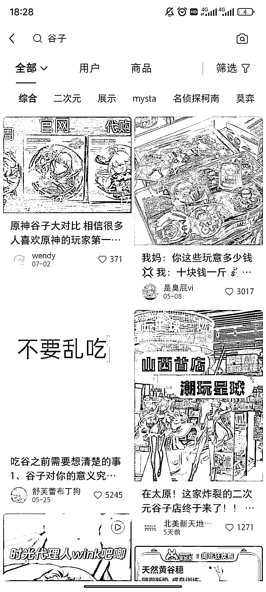
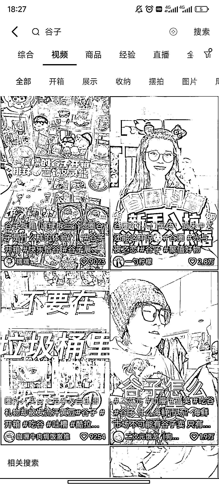
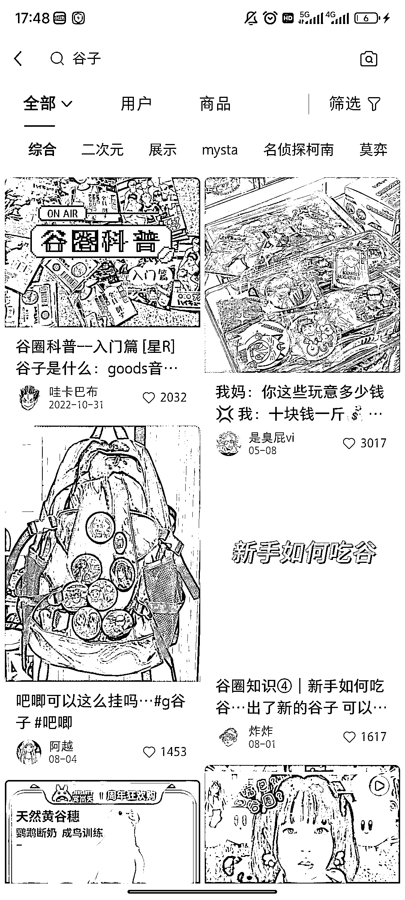
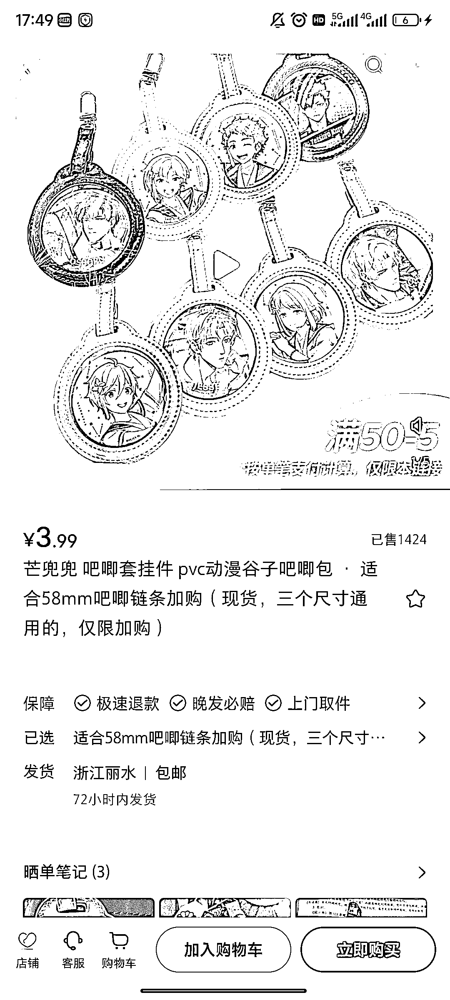
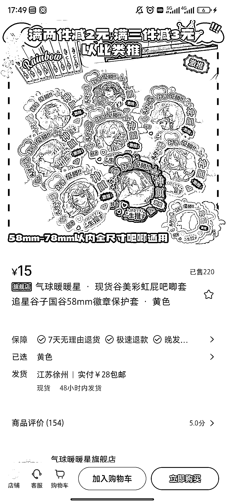

# 小红书电商新品推荐：谷子动漫周边，收藏价值高，有爆款潜力

> 原文：[`www.yuque.com/for_lazy/xkrm14/ufz7ghxzbnz9pyb0`](https://www.yuque.com/for_lazy/xkrm14/ufz7ghxzbnz9pyb0)

作者： 发光

日期：2023-08-28

点赞数：**59**

* * *

正文：

我们都知道电商选品，一些小众领域，非标高复购的品是比较有操作价值的 这边提供一个最近了解的品——“谷子”
指的是一些动漫的周边，有一定的收藏价值，人群标签打好有卖爆的可能，最近研究小红书电商的朋友可以简单了解一下，具体可以看图

* * *

评论区：

发光 : [玫瑰][玫瑰][玫瑰]

古辛 : 谷圈，亚文化小圈子的一种，谷圈指收集 ACG(动画、漫画、游戏的统称)周边产品的群体,
他们的收集物被称作“谷子。“谷子”品种涵盖衣食住行,较常见的是徽章和玩偶。

* * *

