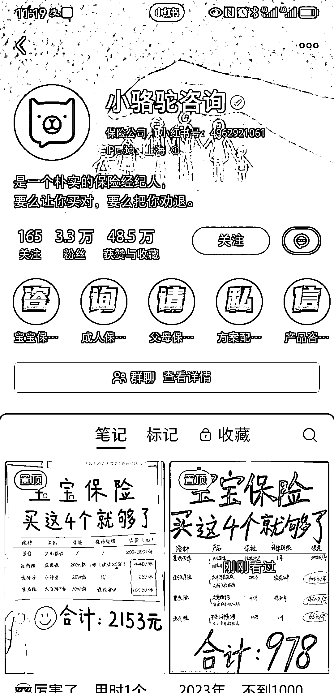

# 小红书保险赛道：从少儿保险入手，精准拿下宝妈流量

> 原文：[`www.yuque.com/for_lazy/xkrm14/lhb42faihgtggtzc`](https://www.yuque.com/for_lazy/xkrm14/lhb42faihgtggtzc)

作者： 大勇非勇

日期：2023-08-31

点赞数：**68**

* * *

正文：

小红书保险赛道 感觉小红书保险赛道真的可做。尤其可以从少儿保险垂直入手，直接拿精准的宝妈流量。图文素材简单已做就是需要一些专业信息。
可以矩阵化运作，引流后对接第三方服务。 虽然考虑生育率下降的问题，但感觉做个三五年没问题，流量转到私域照样可以其他方式短期长期变现。

* * *

评论区：

胡洋 : 生育率虽然下来了，但养娃的成本确实是逐年增加，这方面保险应该是可以做的

Ray-王萌 : 我前年搜索保险的时候，发现他们在百度竞价上也投放有广告，搭配公众号做承接

大勇非勇 : 现在就是研究一下第三方承接服务的流程，感觉流量真不是问题。

王左右 : 有没有提供宝宝保险服务的团队？我这边都是孕期到 3 岁以内的宝妈，可以合作。

张达达 : 我加你一下，或者你加我 makefriend168

Kilo : 左下角的立即咨询是不是需要用企业注册

张达达 : 需要第三方保险资源可以加我 makefriend168

* * *

公众号懒人找资源，懒人专属群分享