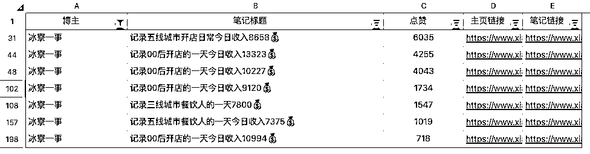
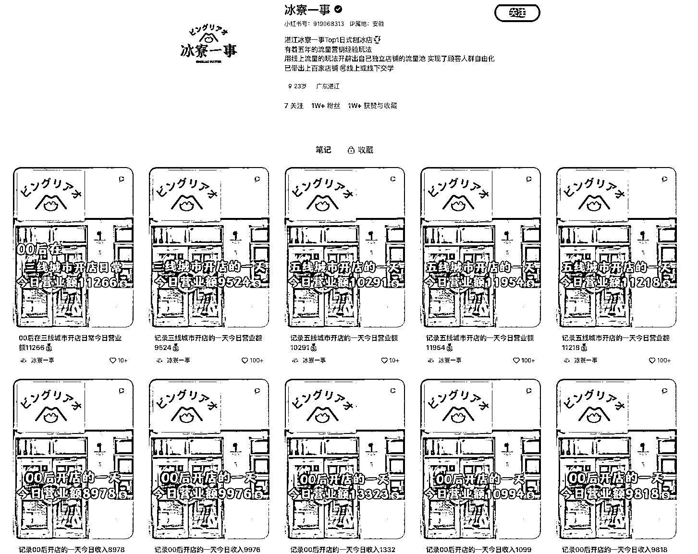

# 小红书账号分享餐饮门店营业经验，火爆菜品吸引眼球

> 原文：[`www.yuque.com/for_lazy/xkrm14/guww5ivytqa6u0qv`](https://www.yuque.com/for_lazy/xkrm14/guww5ivytqa6u0qv)

作者： 周伯通

日期：2023-08-31

点赞数：**41**

* * *

正文：

统计小红书热度标题的时候偶然发现这个账号，账号 7 篇笔记进点赞榜单前 300 名
标题都是一样格式：“无线城市/00 后开店”+“开店的一天”+“大几千/过万的营业额” 视频也是几乎一样的内容形式： 店内火爆+颜值高的菜品+营业额展示
十分适合餐饮门店学习借鉴，拍摄难度和运营成本相对低，吸睛程度一点不比在外请专业团队拍摄的精品视频弱

* * *

评论区：

平老板 : 请问图一是用什么软件采集的，谢谢

周伯通 : 后羿

平老板 : 谢谢

* * *

公众号懒人找资源，懒人专属群分享