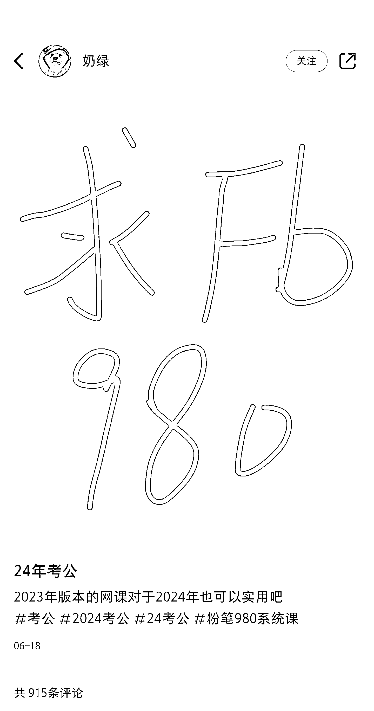
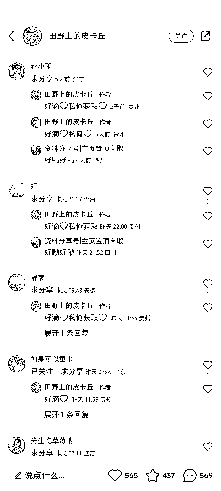
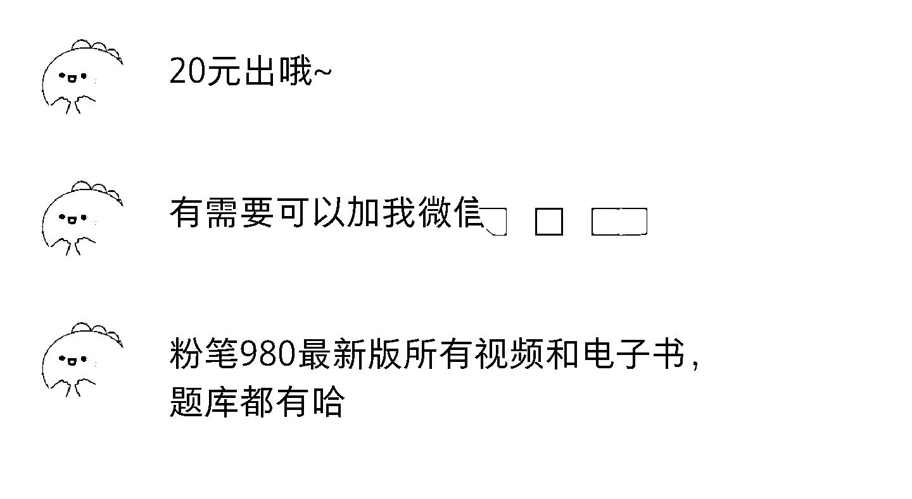
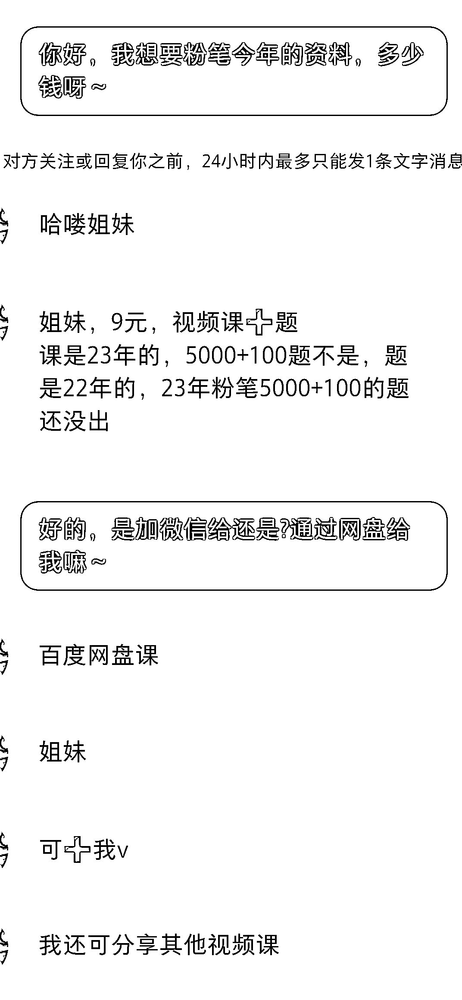

# 国考备考热，小红书卖考公资料需求大

> 原文：[`www.yuque.com/for_lazy/xkrm14/pc4ep6gz62tlpdfo`](https://www.yuque.com/for_lazy/xkrm14/pc4ep6gz62tlpdfo)

作者： Eilvo

日期：2023-08-30

点赞数：**89**

* * *

正文：

还有三个月左右国考了，小红书卖考公资料需求很大！上千条评论下来几乎都是求资料的！
可打包考公资料去卖，也可借此精准引流至私域。（目前市面上粉笔 980 的口碑比较好，什么叫粉笔 980，就是原价 980 块的粉笔直播课。)
关键词可以设置为“Fb980”（主要是怕直接写粉笔 980 卖盗版太张扬了)“粉笔中公华图”或者“980”“行测申论”等，懂的人都懂。
卖之前可以先去看看市面上现有的账号是怎么卖的，尽量隐晦一点，避免被举报。 可以像图一那样直接丢个相关的关键词，再在评论区引流售卖。
一份资料单价 9-20 不等，资源网上一找一大堆，实在找不到的，花 9 块钱买一份，再自行包装一下，加上一些“绝密资料”“碾压其他资料”“上岸看这个就够了”“刷完干掉绝大部分人”等夸张一点的宣传语，卖个 15-20 一份，赚个差价。
这个需求是长期存在的，不是说今年卖完明年就不能卖了，每年都有大量应届生或者社会人士考公，整理一套资源，今年卖完明年对应节点照样可以卖！也不怕过期，几年以内都是可以接受的，知识点都是差不多的，如果是几年前的资源，也可以降低点单价或者找最新的资源。
当然这个思路也可以迁移到其他方向，例如卖高中学习资料?中考高考资料?考证资料（软考，证券从业资格证...）?事编资料?省考资料?等等。
一份单价不需要很高，主打量。

* * *

评论区：

龙辰 : 但有侵权风险，只能小规模操作

Eilvo : 是的，小规模，而且发布笔记的时候要注意用词，否则反手就被举报或者被判平台违规了

* * *

