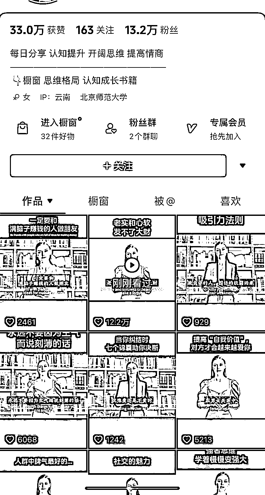

# 使用虚拟 AI 数字人的英文书单号，配音内容有哲理，字幕双语

> 原文：[`www.yuque.com/for_lazy/xkrm14/olyqo34woxzy09g6`](https://www.yuque.com/for_lazy/xkrm14/olyqo34woxzy09g6)

作者： 黄小刀

日期：2023-08-28

点赞数：**103**

* * *

正文：

ai 英文书单号 使用虚拟 ai 数字人直接配音，配音内容一般都是书里的一段有哲理的话，但是是用英文配音朗读出来，字幕做双语字幕 。
变现就是橱窗的图书，销量尚可。

* * *

评论区：

AI 小陈 : 这个形象 有谁知道是什么软件吗

胖大魔 : 刀姐还有三条中标[奸笑]

黄小刀 : 硅基的有免费的外国模特数字人用

左凯 : D-ID

高迹扬 : 抖音号不方便显示吗？

fisher : 是不是可以专注绘本领域，目标孩子家长，提升英语听力

菜菜 : 我前两天发过，没中标，看来这个中标还是要看人，哈哈哈

* * *

