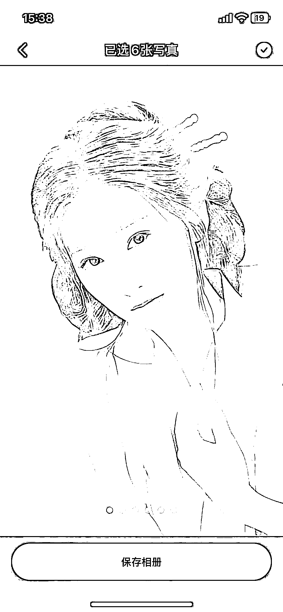

# AI 摄影新功能：上传正脸即可，无需训练 lora，效果自然

> 原文：[`www.yuque.com/for_lazy/xkrm14/wck5eymgfxeab2a8`](https://www.yuque.com/for_lazy/xkrm14/wck5eymgfxeab2a8)

作者： 月起星九

日期：2023-08-28

点赞数：**70**

* * *

正文：

最近一个“剪同款 app”新出了一个 AI 摄影功能，这个不用训练 lora，直接上传一张正脸就行。
虽然出的图有的像，有的不像，但脸还是比 roop 那种自然。还能双人换脸，做闺蜜合照。 只需要一张图的话，确实节省了很多计算资源。

* * *

评论区：

书豪 : 真棒

月起星九 : [旺柴]

* * *

公众号懒人找资源，懒人专属群分享