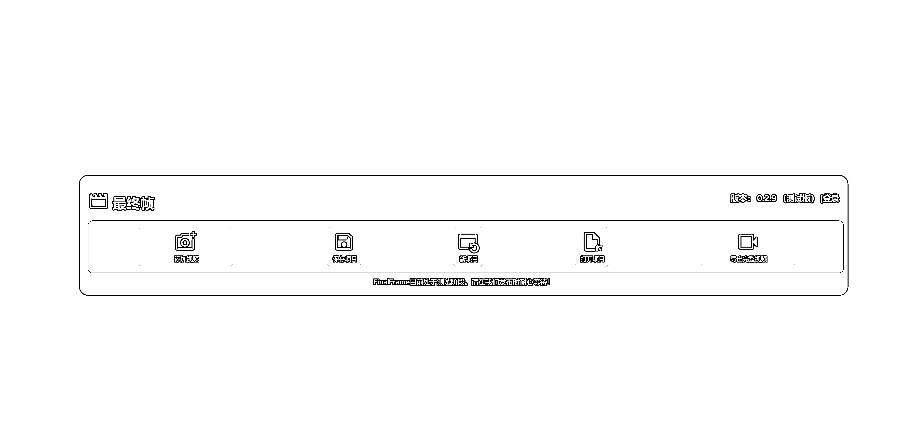

# 突破 Gen 2 限制，无限生成 AI 视频的新工具问世

> 原文：[`www.yuque.com/for_lazy/xkrm14/ee5elmpy6kx44s1f`](https://www.yuque.com/for_lazy/xkrm14/ee5elmpy6kx44s1f)

作者： 睡觉想飞

日期：2023-08-28

点赞数：**71**

* * *

正文：

这个老哥弄了工具，突破 Gen 2 的 4 秒限制，无限生成视频！ 原理就是利用 Gen 2 生成视频的最后一帧作为新的起点，然后在此基础上再投喂给 Gen2
，继续生成新的 AI 视频。如此往复！ 这样，用户就可以通过重复这个过程，将原本只有 4 秒的 AI 视频延长到任意长度。
[`FinalFrame.net`](http://FinalFrame.net)

* * *

评论区：

睡觉想飞 : 哈哈[坏笑]

* * *

公众号懒人找资源，懒人专属群分享