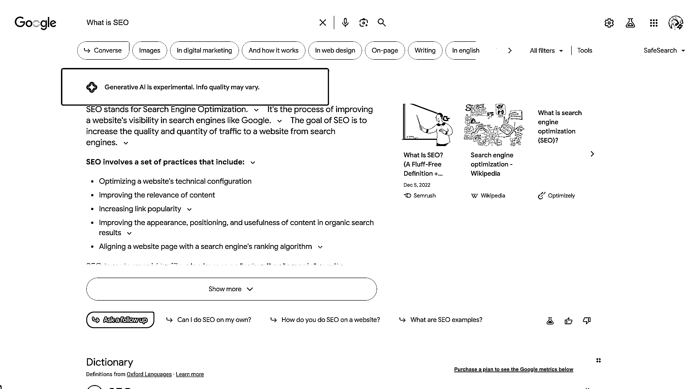

# Google 开通 SGE 测试，AI 生成结果将主导版面

> 原文：[`www.yuque.com/for_lazy/xkrm14/egd3cl6a4cqstrt3`](https://www.yuque.com/for_lazy/xkrm14/egd3cl6a4cqstrt3)

作者： 胡二虎🐯

日期：2023-08-28

点赞数：**63**

* * *

正文：

还没人发这个风向标吗？Google 已经开通了 SGE 测试，AI 的生成结果未来将直接占据整个版面； AIGC SEO will be alive. SEO
was dead. 可以在这里打开设置，需要账号语言切换成英文，网络地区是美国：[`labs.google/sge/`](https://labs.google/sge/) 

* * *

评论区：

初 : 这个风向标是要推 AI 吗？新人看不太懂，望解答[抱拳]

胡二虎🐯 : Google 以后的搜索结果第一条，会是 AI 生成的结果。

初 : 哦，谢谢解答，我现在的工作电脑确实是这样，搜索出来都是 AI 广告。

* * *

