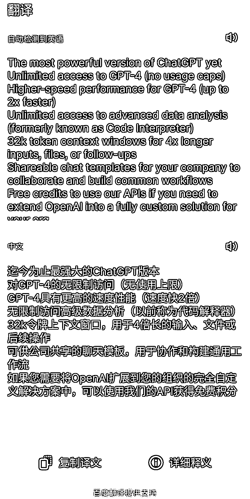

# ChatGPT 开放企业版，无限制推理速度，提供企业管理界面和数据保护服务

> 原文：[`www.yuque.com/for_lazy/xkrm14/nvqiyvr8smd8h9z4`](https://www.yuque.com/for_lazy/xkrm14/nvqiyvr8smd8h9z4)

作者： 许山山

日期：2023-08-29

点赞数：**50**

* * *

正文：

chatgpt 开放企业版，没有 3 小时 50 次的限制，最快两倍于现在的推理速度，提供企业管理界面，权限控制，用户隐私，数据加密等服务，并且不会使用企业数据进行模型的训练和提升。

* * *

评论区：

许山山 : 谢谢老大～

* * *

