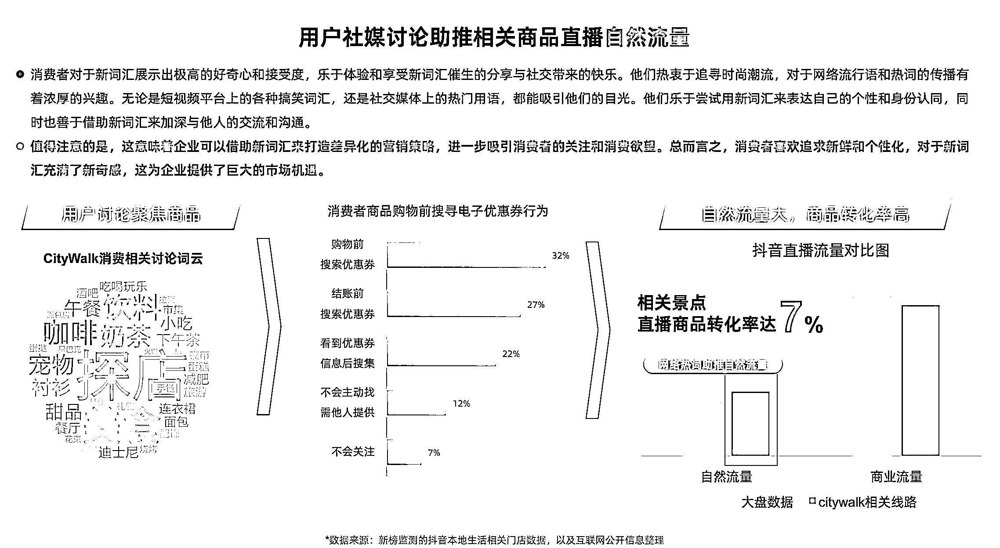

# 抖音直播中 CityWalk 相关景点商品转化率达 7%，值得关注

> 原文：[`www.yuque.com/for_lazy/xkrm14/ka1ve9p14m08znrb`](https://www.yuque.com/for_lazy/xkrm14/ka1ve9p14m08znrb)

作者： 林元陸

日期：2023-08-28

点赞数：**45**

* * *

正文：

在抖音直播，CityWalk 相关景点的商品，转化率达 7%！建议有条件的圈友多加关注。
36 氪的一篇报道指出，CityWalk 是今年的一大热词。涉及到商业层面，可将其视为一种与“本地生活”服务强相关的“消费动线”，即新零售、餐饮、休闲娱乐结合的场景组合。
此类数字热词也在催生本地生活业态“以旧换新”。新榜发布的《CityWalk 本地生活商业价值洞察》报告指出，在快节奏的网络世界中，消费方式向线上转移，线下场景的消费能力陷入疲惫期，CityWalk 的出现重新激发了人们线下消费的热情，为原本疲劳的业态注入了新的活力。
具体数据来看，在抖音平台上，热词“CityWalk”助推的自然流量和商业流量均明显高于大盘，也促成了较高的商品转化率，CityWalk 相关景点的直播商品转化率达 7%。该报告同时提出，CityWalk 是区域品牌的机会所在，在郑州开有 6 家门店的「百分五咖啡」，在周年庆之际，推出“CityWalk 边走边喝集章之旅”，活动期间单日营业额提升 20%。
参考资料： [9 家消费公司拿到新钱，幸运咖门店增速下滑，CityWalk 相关商品直播转化率达 7%｜创投大视野-36...](https://36kr.com/p/2404296988091393) 

* * *

评论区：

* * *

