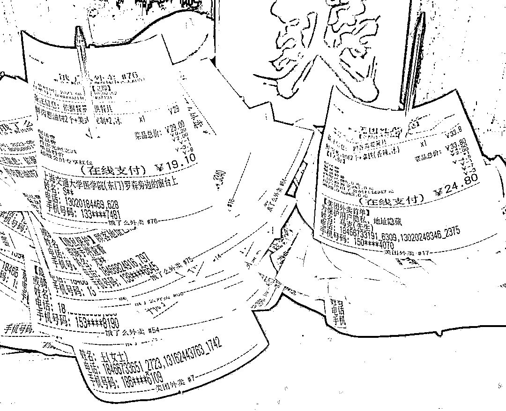
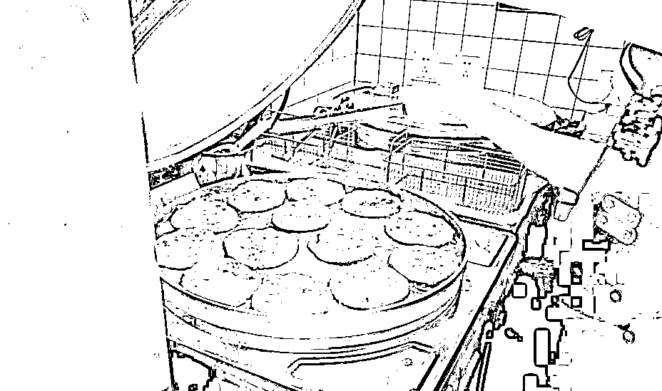

# 上海街边小店火爆，6 元美式、8 元鲜肉饼成风向标

> 原文：[`www.yuque.com/for_lazy/xkrm14/wb0uayochrx0uaw0`](https://www.yuque.com/for_lazy/xkrm14/wb0uayochrx0uaw0)

作者： 李瑞腾

日期：2023-08-28

点赞数：**115**

* * *

正文：

6 元美式、8 元鲜肉饼小店在上海爆火
16 平方米的街边小店，每天能卖出 400～500 杯咖啡、近 1000 个鲜肉饼，日营业额可以做到 1.1 万～1.2 万元，在节假日等营业低谷也能做到 9000 元。
客源：除了周边写字楼、社区的消费者，专程到店打卡的网友络绎不绝。 老板认为在保证安全卫生，让消费者吃饱喝好，是最简单的餐饮逻辑。
采用明档厨房，全线咖啡使用埃塞拼配豆现磨现制，而鲜肉饼则采购新鲜后腿肉在门店绞打，要求每个饼填充馅料不低于 50 克。
把品质做到最好，把毛利率探到最低，才能为自己争取更多的生存空间
门店外卖占比 48%，门店“早 8 晚 9”全时段营业，每天有两个销售高峰，一个是 8:00～12:00 的早午餐场景，另一个便是下午 3:00 以后，不仅有白领购买咖啡套餐用于下午茶，也有不少附近老一辈的居民结伴买饼，甚至出现小区团购现象。
选址：在核心商圈的非核心街道，在保证较低租金成本的同时，也能够覆盖周边的学校、写字楼、居民区。
大环境不好，消费降级，巨头林立的情况，小店的突围之路，供做实体的圈友参考。

* * *

评论区：

志豪 : 上次也看到北京的门店推出三元早餐

蓝大虎 : 分析的很好哇

帅帅🔫🌱 : 这个非常不错啊！

航哥 : 看看北京的南城香

Yao : 这种搭配满足了很多喜欢咖啡+中式早餐的用户

李瑞腾 : 在一线城市只做早餐的夫妻店，也很赚，比如杂粮煎饼，目标人群（上班族）足够多

李瑞腾 : 有用就好

* * *

