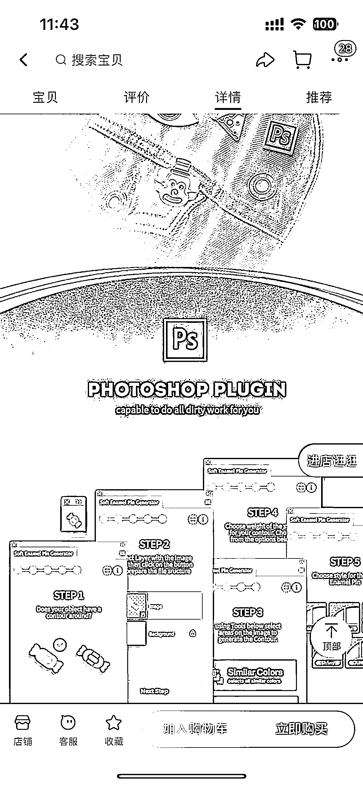

# 信息差赚钱的小思路：利用官方免费软件搬运到自己店铺销售

> 原文：[`www.yuque.com/for_lazy/xkrm14/hmigvwmw6hnw7eef`](https://www.yuque.com/for_lazy/xkrm14/hmigvwmw6hnw7eef)

作者： 矛盾

日期：2023-09-01

点赞数：**82**

* * *

正文：

信息差赚钱的小思路 最近在找软件的一个插件，发现了这么一个路子，感觉挺有意思。 左侧图一图二是官方网站，写的插件式免费下载，我使用了确实是免费的。
右侧是淘宝，店铺的介绍都是人家官方网站，一模一样，然后插件卖 5 元钱，自动发货，有安装说明，安装说明就是官网的不走，评论区回复的问题，好使的就不说了，不好用的跟我出现的官方下载是一样的，无人处理。
而国内大部分这个软件写了中文汉化，是魔改的版本，有需要的自然需要付费，不讨论。 这个店铺完全就是拿着官方的免费软件，搬运到自己的店铺，自动发货的虚拟软件类。
感觉思路能有人付费： 1.
这个插件在国内搜索引擎上都是中文名字，非官方名字，所以很难找到官网，没有魔法很难搜到信息。（google 搜索排名第一个，并且免费） 2.
品类小众且细分，小众到如果你需要，就会非他不可，搜资料该功能都推荐这个产品。（找不到其他的替代品） 3.
这个产品在网上，要么是会员充钱、要么是积分换取、要么淘宝店，白嫖的链接大部分都失效或者不好用。 那是不是可以参考这个方式，做一些小众东西。

* * *

评论区：

矛盾 : 哇，感谢亦仁大佬！

* * *

