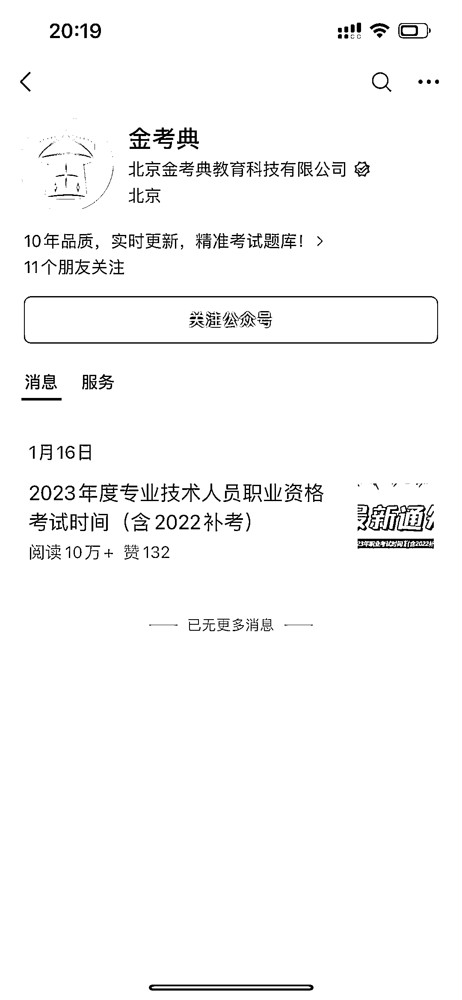
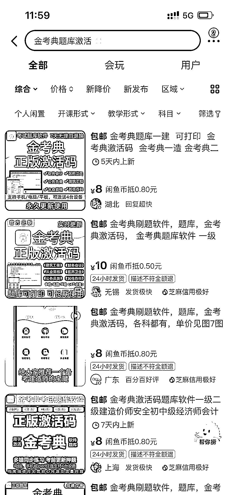

# 考试资料价格差异大，风向标指向赚钱快速的机会

> 原文：[`www.yuque.com/for_lazy/xkrm14/mzck3qei0dynq25z`](https://www.yuque.com/for_lazy/xkrm14/mzck3qei0dynq25z)

作者： 帅彬

日期：2023-09-01

点赞数：**70**

* * *

正文：

这种考试的我淘宝问 10 元，公众号 30 元，闲鱼 8 元，拼多多 2 元…感觉会做资料的人赚钱蛮快的，毕竟要考试的东西有 4、5 十个。会计、建造师等等

* * *

评论区：

* * *

