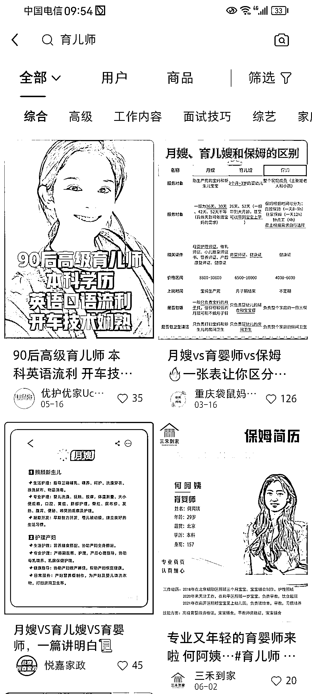

# 育儿师：新兴职业，市场潜力巨大

> 原文：[`www.yuque.com/for_lazy/xkrm14/ysrvozlrvzcfebw6`](https://www.yuque.com/for_lazy/xkrm14/ysrvozlrvzcfebw6)

作者： 三恒

日期：2023-09-01

点赞数：**63**

* * *

正文：

【育儿师】，感觉是个好赛道！同城赛道+本身有做教培的可以关注一下，或者同城引流
包括，如果你现在手里的项目和私域是这部分用户群体的，也可以推出相应的服务产品，高客单、高复购、高利润。
很少听到这个职业名词，昨天和我社群内的伙计线下聚会，有位朋友聊起来他的这个职业，刚听到我很惊讶，因为听他的这个介绍，【育儿师】这个职业干的就是给别人的娃当爹的事。
陪、还是高质量的陪，从白天接娃出去，到晚上送回来。包括对孩子的各项教育，感兴趣的可以去了解！ 聊了聊，总结一下我观察到的机会：
1、面向的用户群体：主要是带娃的女性、以及单身妈妈的用户
2、需求：单亲妈妈带娃的现象，极大概率是带不好娃的（我分析这是因为对孩子缺乏侧面影响，也就是需要第三方参与互动，教育效果才会更好）
3、地域上，这个行业面向的城市群体还是 1-2 线的大城市居多
4、变现：他的定价是 15 天 3w 左右。我大概查了查，刚入门的均价在 7000 以上，如果你本身有这个能力和私域用户沉淀，爆发会很快！ 同城可以搞！欢迎补充交流

* * *

评论区：

海阔天空 : 育婴师，换了个词而已，可以说是孩子的奶妈

三恒 : 还是有区别的，奶妈也好，保姆也罢，服务解决的只不过是吃喝拉撒的问题，是基本生存的问题。育婴师偏向于对孩子的社会教育

东方既白 : 市场需求不多，把岗位炒热，靠培训发证赚钱

海阔天空 : 需求也挺多的吧，我在深圳，经常听到老板说客户对这个育儿嫂不满意啥的，客户动不动就要换人..... 阿姨需要高工资，活少，省事
客户想以最低的钱找到合适的人，勤快，孩子带得好，专业.... 真正要找到一个,能使双方都满意的、合得来的是真的很难，估计比找对象还难，哈哈

* * *

