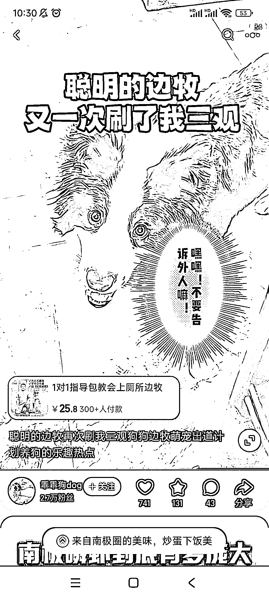

# 宠物赛道+知识付费细分，蓝海需求不断涌现

> 原文：[`www.yuque.com/for_lazy/xkrm14/ypi0phlkdfnggvum`](https://www.yuque.com/for_lazy/xkrm14/ypi0phlkdfnggvum)

作者： 阿黎

日期：2023-08-28

点赞数：**75**

* * *

正文：

宠物赛道+知识付费细分，有很多蓝海需求，比如教狗上厕所包教会，单店铺，25 元的课就卖了 1w+。
同理可得，教猫如何如何，养热带鱼如何如何，养鹦鹉如何如何，养花如何如何，插花如何如何，都有很多细分的蓝海，关键还是虚拟产品

* * *

评论区：

阿超 : 小众又有需求，nice

百万先生 : 其实这类在抖音一大把，靠的就是信息差

* * *

公众号懒人找资源，懒人专属群分享