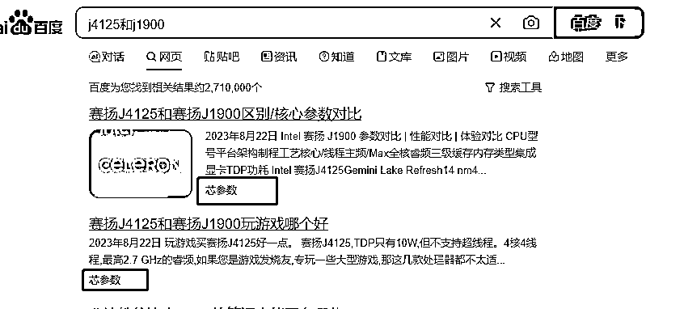
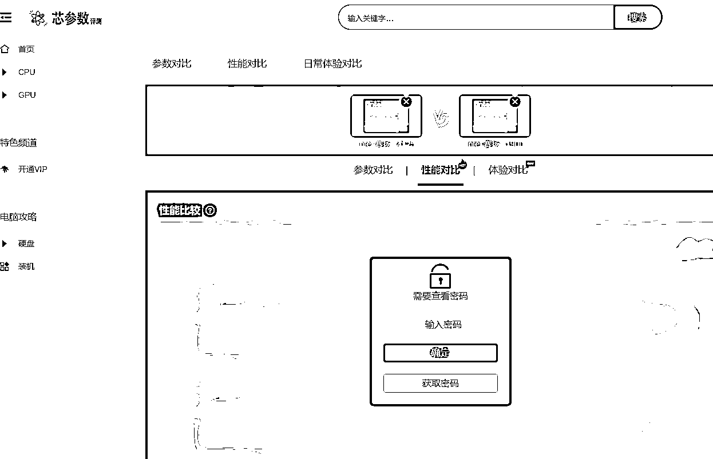
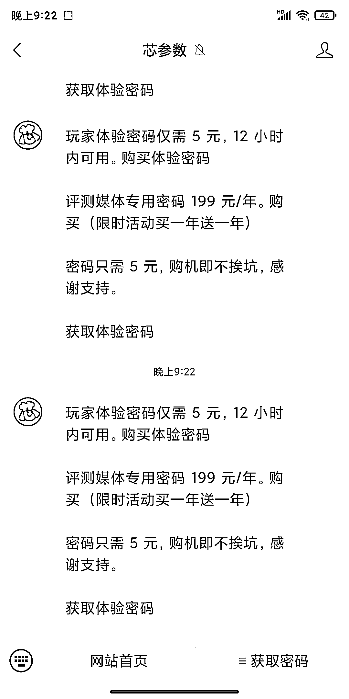

# 发现一个 SEO 牛的蓝海站点，通过对比类内容轻松获取流量

> 原文：[`www.yuque.com/for_lazy/xkrm14/tg9naql9phhlrkml`](https://www.yuque.com/for_lazy/xkrm14/tg9naql9phhlrkml)

作者： 闪电兄

日期：2023-08-31

点赞数：**71**

* * *

正文：

最近发现一个 SEO 非常牛的蓝海站点，芯片对比，他们依靠 SEO 获取到了不少流量。。免费版只能查看参数对比，如果想查看性能等对比，需要开通会员。可以发散思维，做对比类的站点，通过 SEO 很容易获取流量。

* * *

评论区：

晨冬 : 百度的几个产品这个思路已经用的很好了，比如高考院校对比，汽车车型对比

* * *

公众号懒人找资源，懒人专属群分享