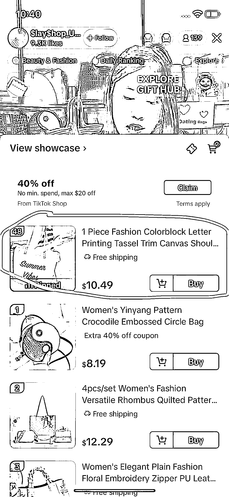
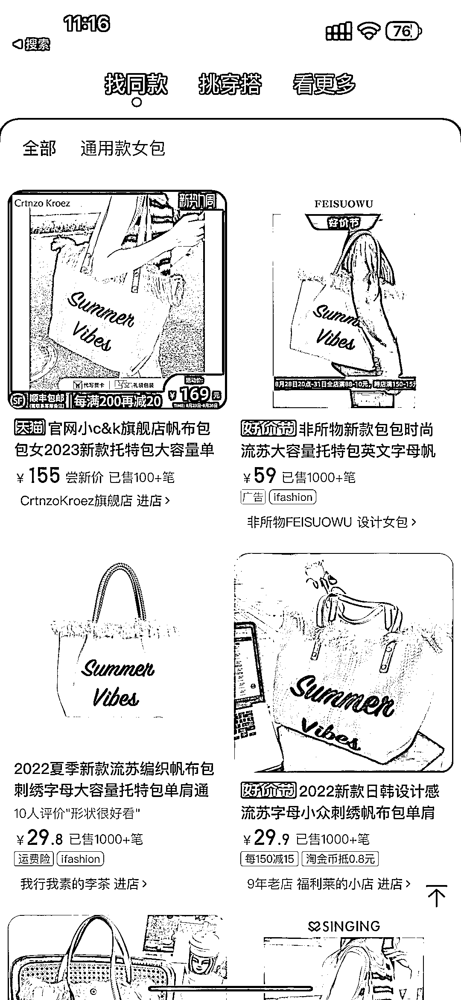
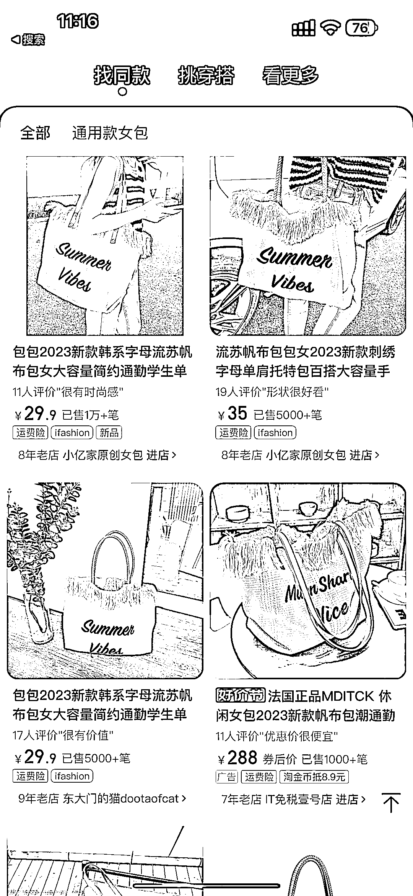
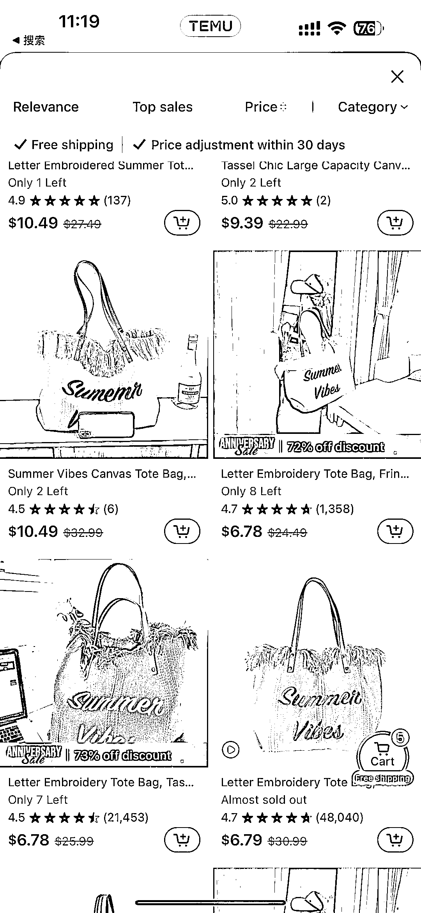

# 抖音、拼多多、shein 海外价格战，比价工具能否笑到最后？

> 原文：[`www.yuque.com/for_lazy/xkrm14/nyqq7bykiz20hygr`](https://www.yuque.com/for_lazy/xkrm14/nyqq7bykiz20hygr)

作者： 皮特船长

日期：2023-08-28

点赞数：**60**

* * *

正文：

抖音、拼多多、shein 在海外拼价格战，上线比价工具会笑到最后？
抖音、拼多多、shein 三家中国公司，都在以全托管的模式，将商品流转链路缩到最短，商品成本压缩到最极致，以此来获取新用户，并希望占领用户产品低价的心智
1、做一个比价工具帮助用户选择价格最低的那个产品，直接解决美丽国羊毛党痛点 2、搜图比价功能加入中国 1688 等批发网站数据，还能帮助海外小 b 端做采购找供应商
3、比价软件还是一个话题，适合做内容营销

* * *

评论区：

* * *

公众号懒人找资源，懒人专属群分享